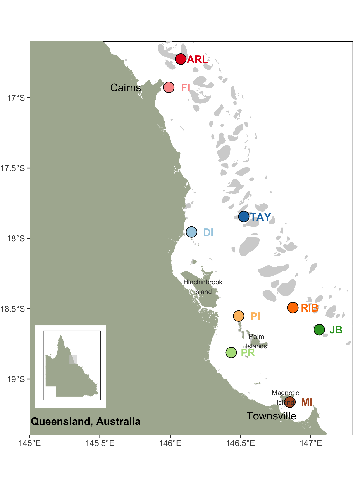

```{r setup, include=FALSE}
knitr::opts_chunk$set(echo = FALSE, warning = FALSE, message = FALSE, fig.retina = 2)
library(tidyverse)
library(ggpubr)
library(ggbreak)
library(knitr)
source("scripts/my_color.R")
```


```{r map}


```


 *Acropora tenius* corals were collected from both inshore and offshore Great Barrier Reef (GBR) at 9 reef locations.

- Inshore reefs
  - Magnetic Island (MI, n=28)
  - Pandora Reef (PR, n=30)
  - Pelorus Island (PI, n=30)
  - Dunk Island (DI, n=30)
  - Fitzroy Island (FI, n=30)

- Offshore reefs
  - Arlington Reef (ARL, n=20)
  - Taylor Reef (TAY, n=20)
  - Rib Reef (RIB, n=20)
  - John Brewer Reef (JB, n=20)

The extracted DNA was sequenced at shallow depth **(~2-5x)** with 100bp paired sequences. Some samples were sequenced in multiple lines or flowcells, thus, one sample has several fastq files.

> There were two samples (FI-1-3, MI-1-4) been sequenced at higher depths. We mapped all reads from them to reference genome assembly and down-sampled to average depth randomly from their bam files.

- **Data of inshore reefs from Cooke et al 2020**

  Each sample was sequenced in 2 lanes with paired-end reads, thus, 592 fastq files were generated from 148 samples.

- **Data of offshore reefs from AIMS**

  80 samples, each with 2 lanes and 2 batches, form 640 fastq files.

List of filenames and sample info table can be found [here](https://docs.google.com/spreadsheets/d/1sArk4d6xUXZzDHxBPvQEfcudYWERo7W7Xp-Va3FbQeE/edit?usp=sharing)

**Sequencing data summary**

Data yield per sample ranging from 0.423-2.49Gbp.Based on a genome size of 487Mb (486,812,518), samples were sequenced at 0.87X-5.12X depths (except for two high sequencing depth samples: 23.84X,11.6Gbp; 25.90X,12.6Gbp).

```{r seq-data}
df <- read_csv("data/hpc/qc/summary_data.csv") %>% mutate(pop_order=site_order()[pop])
df %>% ggplot(aes(x=reorder(pop,pop_order),y=total_bases/1e+9,color=pop)) + 
  geom_boxplot() + 
  geom_point(color="darkgrey",size=.5) +
  scale_color_manual(values = site_colors(),guide=F) +
  scale_y_break(c(2.0,11.0)) +
  theme_pubclean()+labs(x="",y="Total base (Gb)")
```

*Notice that samples from Magnetic Island have least data sequenced and samples from offshore reefs have slightly more data than samples from inshore reefs*


