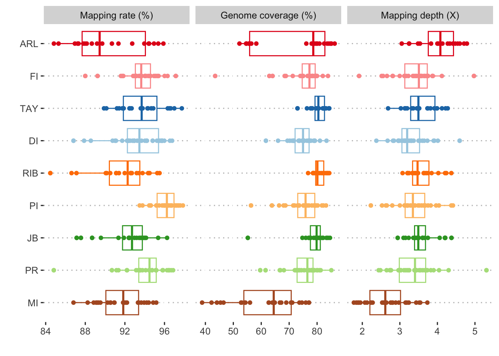

Read alignment
================

### Choice of genome reference

For all mapping and alignment tasks in this paper we used the *Acropora
kenti* genome assembly [version
v0.11](http://aten.reefgenomics.org/download/). This assembly was
originally labelled *Acropora tenuis* but the taxonomy of this group has
since been revised by Bridge et al. (2023). As part of this revision
*Acropora tenuis* from the Great Barrier Reef has been renamed to
*Acropora kenti* and is more closely related to *Acropora echinata* than
to *Acropora tenuis* from Japan and Western Australia. Our genome
assembly corresponds to a specimen from Orpheus Island (GBR) and is
therefore *Acropora kenti*.

Initial steps for read mapping follow the GATK germline best practices
guidelines. This ensures proper marking of adapters, duplicate removal
and addition of read group tags in the resulting bam files.

### 0. Index genome

We used `bwa index`, `samtools faidx`, and
`picard CreateSequenceDictionary` to generate the dictionary and index
files for gatk variant calling workflow.

``` bash
bwa index reference.fa
samtools faidx reference.fa
picard CreateSequenceDictionary R=reference.fasta O=reference.fasta.dict
```

### 1. Generate mapping files

We used `bwa` (v0.7.17-r1188) to map short reads of each sample
library/batch/lane to reference genome assembly, separately. Before
mapping, the fastq files were converted to unmapped bam files with read
group information using `picard FastqToSam` then the adapter sequences
in reads were marked using `picard MarkIlluminaAdapters`. This step was
implemented in snakemake script
[readAlignment.smk](scripts/hpc/preprocessing/01.readAlignment_inner.smk).

Next, we used `gatk Markduplicates` to mark duplicated reads and merge
multiple bam files for each sample as gatk
[suggested](https://gatk.broadinstitute.org/hc/en-us/articles/360035889471-How-should-I-pre-process-data-from-multiplexed-sequencing-and-multi-library-designs-).
We made sure the bam files were sorted by coordinates to ensure
duplicates from secondary alignments were marked.

### 2. Down-sampling high sequenced samples

Before variant calling, we generated down-sampled version of two high
depth samples (FI-1-3, MI-1-4) using `sambamba view`.

``` bash
sambamba view -f bam -s 0.13 -t 10 --subsampling-seed=36 FI-1-3_S9_aligned_duplicates_marked_sorted.bam -o FI-1-3_subsampled_aligned_duplicates_marked_sorted.bam
sambamba view -f bam -s 0.12 -t 10 --subsampling-seed=36 MI-1-4_S10_aligned_duplicates_marked_sorted.bam -o MI-1-4_subsampled_aligned_duplicates_marked_sorted.bam
```

### 3. Summary of Mapping results

Mapping coverage and depth were summarised using the `samtools depth`
command

``` bash
samtools depth -a $bamfile |awk '{sum+=$3;if($3>0) {n++}}END{print "coverge:",n/NR,";mapping depth:"sum/NR,";net mapping depth:",sum/n}' 
```

Across all samples, the average mapping rate is 93.12% (84.47%-97.86%),
average genome coverage is 74.30% (38.82%-86.30%), the coverage depth is
3.39X (1.77X-5.30X).



**Figure 1: Summary of read mapping statistics for all samples**. Note
that mapping depths were calculated based on covered regions instead of
average mapping depth across the entire genome.

<div id="refs" class="references csl-bib-body hanging-indent">

<div id="ref-Bridge2023-mi" class="csl-entry">

Bridge, Tom C L, Peter F Cowman, Andrea M Quattrini, Victor E Bonito,
Frederic Sinniger, Saki Harii, Catherine E I Head, et al. 2023. “A
Tenuis Relationship: Traditional Taxonomy Obscures Systematics and
Biogeography of the ‘Acropora Tenuis’ (Scleractinia: Acroporidae)
Species Complex.” *Zool. J. Linn. Soc.*

</div>

</div>
