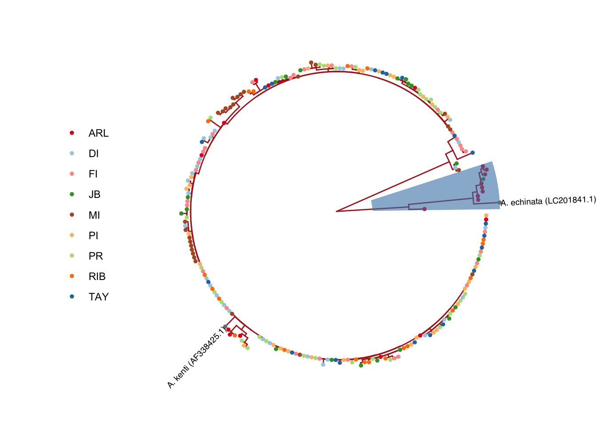
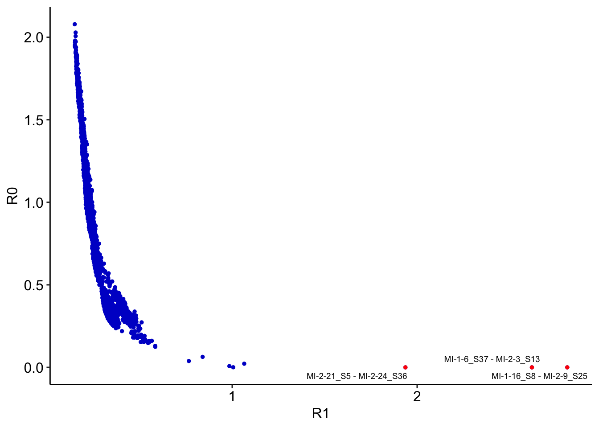
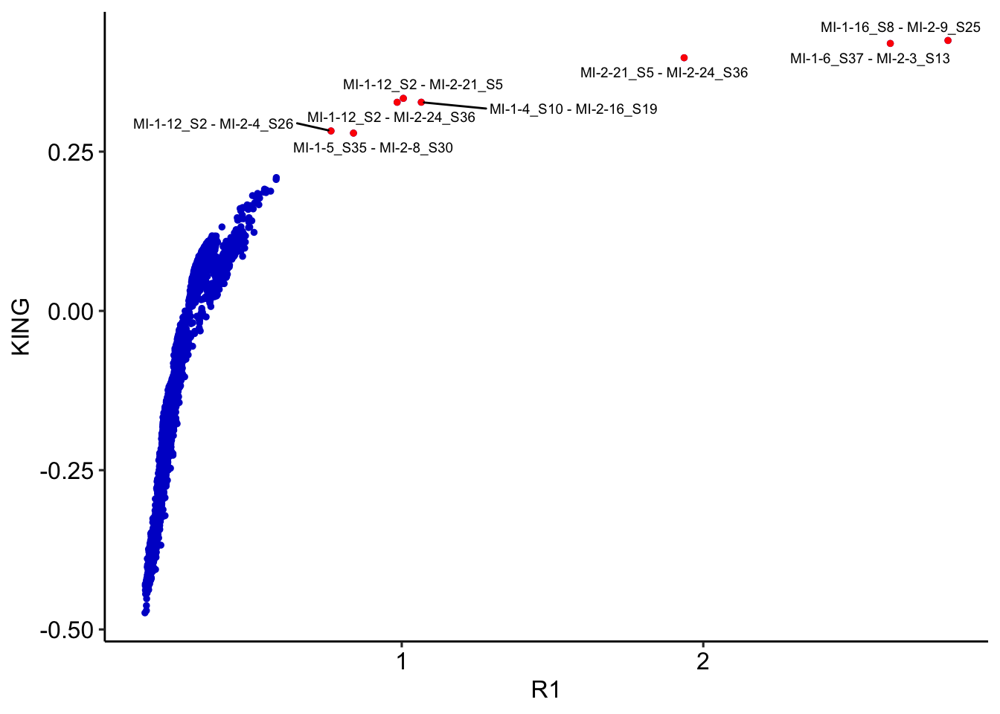
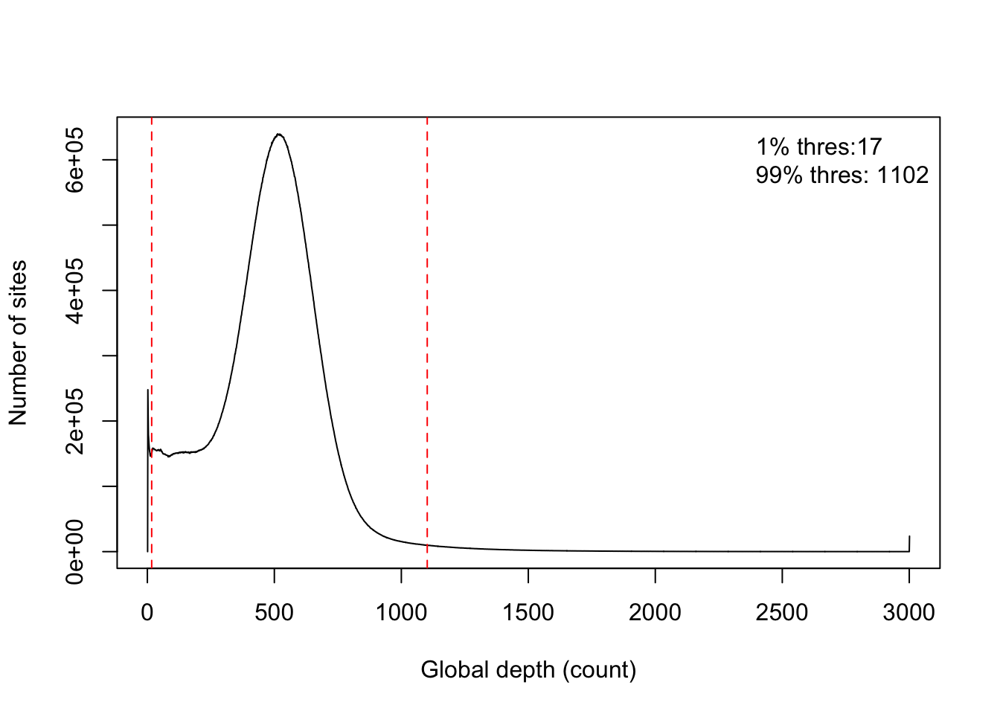

Sample and reference filtering
================

## Sample filtering

### 1. Blast analysis of mtDNA

We mapped reads to A.tenius mitochondrial DNA sequence and used
`ANGSD doFasta2` to get the most like mitochondrial sequences of every
sample. We then blast these mitochondrial genome to NCBI nt database to
check to best match species. We found 10 samples with a best hit to
other Acropora spp.

``` bash
angsd -dofasta 2 -doCounts 1 -i {sample}_mito.bam -out fasta/{sample}_mito
gzip -d fasta/{sample}_mito.fa.gz
blastn -task megablast -db nt -query {sample}_mito.fa -remote -outfmt  '6 qseqid sseqid pident mismatch gapopen evalue staxids sscinames scomnames sskingdoms stitle' -out {sample}.blast
```

Next, we build a tree using iqtree with these sequences. There are 9
samples from Arlington reef and 1 from John Brewer Reef form a separate
cluster from other samples. As we included mitogenome of *A.tenuis* and
*A.echinata*, this is consistent with our blast results as 8 ARL samples
and 1 JB samples matched with *A.echinata* and 1 ARL sample matched to
*A.florida*.



We thus excluded these 10 samples in this step.

### Identification of relatives

As clones or close related individuals could confound the results, we
used `ngsRelate` to calculate the pairwise relatedness of all samples
and remove one from any related sample pairs. We firstly did a
preliminary angsd genotype likelihood computation for common polymorphic
sites (maf\>0.05, SNP p_value \<1e-6) and limited to sites with a
minimal base quality of 30 and with reads of minimal mapping quality of
30.

``` bash
angsd -ref reference.fasta -b all_bam.list -GL 2 -doGlf 2 \
-doMajorMinor 1 -SNP_pval 1e-6 -doMaf 1 \
-minMapQ 30 -minQ 30 -minMaf 0.05 -out atenius -nThreads 30

zcat atenius.mafs.gz | cut -f 5 |sed '1d' > freq
ngsRelate -G atenius.beagle.gz -n 228 -f freq -p 30 -l 0.05 -O atenius.ngsrelate.txt
```

We then plotted the combinations of R0,R1 and R1-KING-robust kinship
statistics of each pair of samples to infer relationships follow the
methods in <https://onlinelibrary.wiley.com/doi/10.1111/mec.14954>.

There are three pairwise values clear deviated from the main cluster and
are potential FS/OF relationship. These outliers are from Magnetic
Island , we thus kept one with higher coverage from each pair in the
following analysis. They have KING-robust kinship \> 0.397, R1\>1.94,
R0\<0.000016.

-   117-119 (MI-2-21_S5, MI-2-24_S36)
-   111-123 (MI-1-6_S37, MI-2-3_S13)
-   103-127 (MI-1-16_S8, MI-2-9_S25)

samples to remove (the one with lower sequencing depth from each pair):

-   MI-2-21_S5
-   MI-2-3_S13
-   MI-1-16_S8



After this, we left 215 samples to go.

## Reference filtering

### 1. Mappability

We excluded genomic regions that can not be uniquely mapped by estimate
the mappability of each site across the genome using [genmap
v1.3.0](https://github.com/cpockrandt/genmap) with 50bp kmer size.

``` bash
genmap -F reference fasta -I genmap_index
genmap map -K 50 -E 2 -I genmap_index -O reference_mappability_K50_E2 -t -w -bg
awk '$4==1{print $1"\t"$2"\t"$3}' reference_mappability_K50_E2.bedgraph > reference_mappability_K50_E2.unique.bed
```

There were 264,895,970 bp left.

### 2.Simple repeat regions

We used mdust to remove genomic regions that are short simply repeats.
Next, we subtract these regions from mappability region in following
analysis.

``` bash
mdust reference.fasta -c |cut -f1,3,4 > reference.mdust.bed
bedtools subtract -a reference_mappability_K50_E2.unique.bed -b reference.mdust.bed > reference_mappability_K50_E2.unique_mdust.bed
```

After this, 263,812,390 bp left.

### 3.Global depth

Genome regions with a lot of reads mapped or very little reads mapped
should also be excluded in our analysis to avoid bias. We used `ANGSD`
to calculate mapping depth of all samples across filtered genomic
regions with minMapQ\>30 and minQ \>30. Next, we used 1% quantile and
99% quantile global depth values as lower and upper threshold depth in
the following genotype likelihood estimate.

``` bash
angsd sites index reference_mappability_K50_E2.unique_mdust.bed
angsd -minMapQ 30 -minQ 30 -doCounts 1 -doDepth 1 -dumpCounts 1 -maxdepth 3000 -b ind215_bam.list -out atenius  -nThreads 20 -sites reference_mappability_K50_E2.unique_mdust.bed
```


