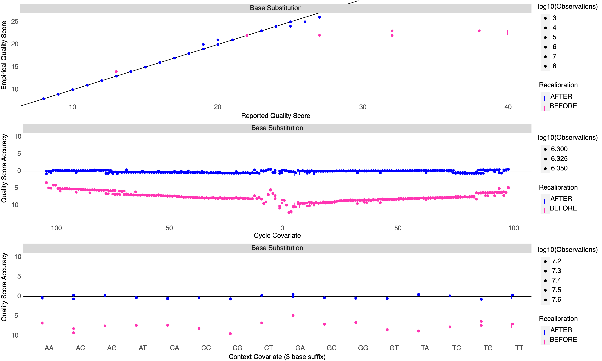

```{r setup, include=FALSE}
knitr::opts_chunk$set(echo = FALSE, warning = FALSE, message = FALSE, fig.retina = 2)
library(tidyverse)
library(knitr)
```

We then performed variant calling following gatk4 germline variant calling workflow.

### GATK4 joint genotype calling

For 148+80 samples, we did the first round variant calling through running haplotypeCaller to each sample and joint calling for all samples. Next, we applied hard-filtering to the callset and used them as known variants for base quality score recalibration (BQSR). After quality scores in the duplicates marked bam files had been calibrated, we performed another round of variant calling and got our final variant callset from gatk.

Specifically, we set heterozygosity to 0.01 to adjust coral's genome heterozygosity. To speed up the process, we used `gatk SplitIntervals` tools to split genome into 5 intervals in `haplotypeCaller` and BQSR steps, and 500 intervals in `GenomicsDBImport` and `GenotypeGVCFs`steps. The workflow scripts can be found [here](https://github.com/bakeronit/acropora_tenius_wgs/tree/main/scripts/hpc/variantcalling).

```{r, fig.width=16}
include_graphics("figures/gatk4-atenius-workflow.jpg")
```

### Pre- and post-recalibration metrics

Here is an example of the BQSR results where the after base quality scores had increase in score accuracy and fitted well with the empirically-derived quality scores and there was no obvious systematic biases against sequencing cycles, the score distribution became more uniform.

```{r, fig.width=3.2}

```
```{r, fig.width=3.2}
include_graphics("figures/example-anacov2.jpg")
```

After BQSQ, we again ran haplotypeCaller and joint genotyping to bam files and obtain final raw variant callset including **44,844,501 (39,323,153 SNPs + 6,493,068 InDels)** variants. We then applied several [filtering steps](04.variant_filtering.md) to this dataset.

