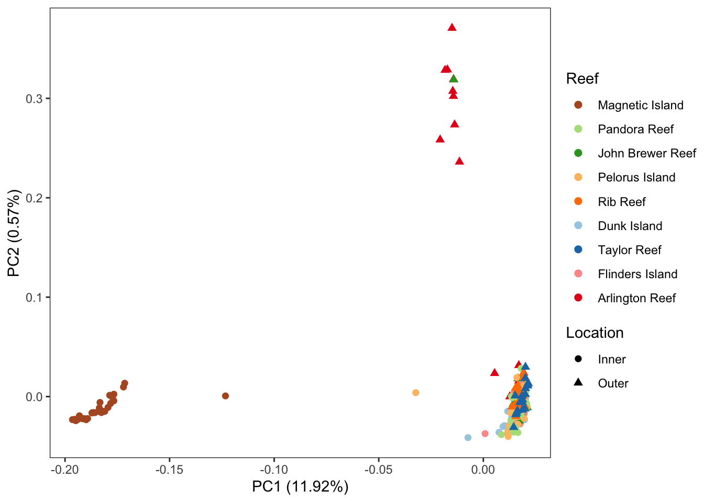
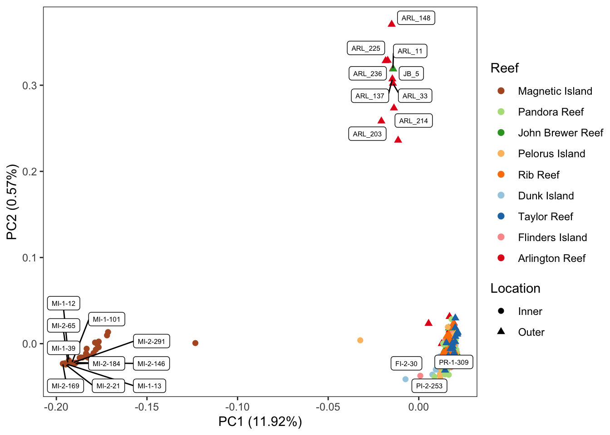
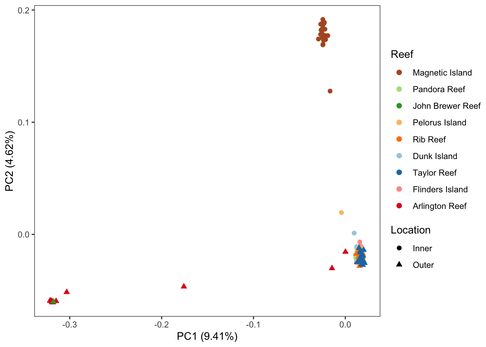
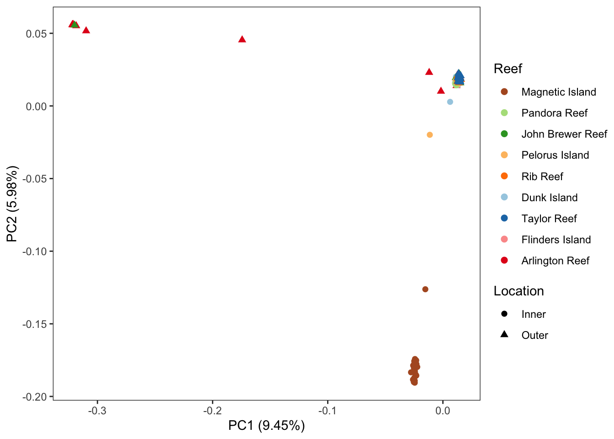
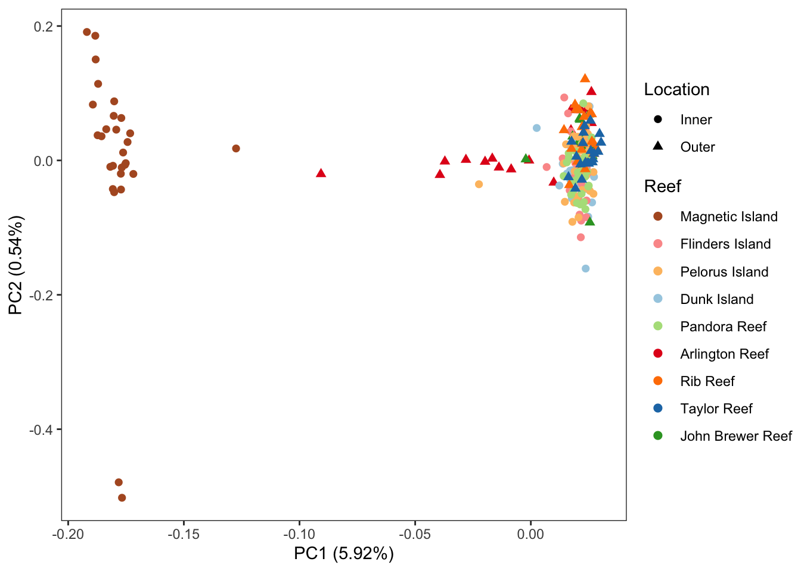

Population structure
================

### 1.PCA based on all SNPs

Firstly, the filtered callset of snps from gatk and angsd were sent to
pcangsd for covariance calculation and the first two principle were
plotted.

``` bash
pcangsd --beagle atenius.beagle.gz --threads 48 --admix --admix_auto 10000 --out atenius.pcangsd
```



We found that samples from Magnetic Island form a separate group and few
samples from Arlington Reef and one from John Brewer Reef seem to form a
cluster at the left downside corner. We then further checked whether
these samples are those with low genome coverage(\<60%) by adding labels
on them.



We also show the PC1 against PC3 and PC2 against PC3


It seems there are three groups of samples with few potential hybrids.
Interestingly, several samples from Arlington Reef and one sample from
John Brewer Reef form a separate cluster. However, most of these samples
did have lower genome coverage. We checked the raw fastq files and it
has not any batch effect? in terms of base quality or duplicates, etc.

### 2. PCA based on sites with \< 50% missing data in each population

To further make sure the structure does exist, we did another PCA based
on sites that were well presented in every population. This is to avoid
using many sites that are fully missing in some reefs while been kept in
analysis because of low missingness in all samples. To achieve this, we
splitted the gatk callset VCF file by population and used angsd to
filter them by data missing. Eventually, we only used sites that were
kept in all reefs in angsd and pcangsd.

**We had to use lower version (0.928) angsd in this step since the
version 0.937 will corrupt**

``` bash
bcftools view --samples-file ${pop}.txt --threads 10 -Oz -o ${pop}.gatk.filtered.vcf.gz atenius.gatk.filtered.vcf.gz

angsd -vcf-pl ${pop}.gatk.filtered.vcf.gz -out ${pop} -fai reference.fasta.fai -nind $n_ind \
-doMaf 1 -doMajorMinor 1 -nThreads 10 -minInd $min_ind

zcat ${pop}.mafs.gz |awk '{print $1"\t"$2"\t"$2}'|grep -v "chromo" > ${data_dir}/${pop}.angsd.bed
multiIntersectBed -i *.angsd.bed | awk '$4==9 {print}' | cut -f1,2 > pop_miss05.site.txt

~/local/angsd/angsd -bam all.bamlist.txt -minMapQ 5 -minQ 20 -GL 2 \
        -out atenius.pop_miss05 -ref reference.fasta \
        -nind 228 -doMaf 1 -doGlf 2 -doMajorMinor 1  -nThreads 30 -sites pop_miss05.site.txt

pcangsd --beagle atenius.pop_miss05.beagle.gz --threads 30 --admix --admix_auto 10000 --out atenius.pop_miss05.pcangsd
```



Apparently, the there are three clusters with few hybrids no matter of
whether keeping those missing sites.

### 3.PCA based on LD pruned dataset

It is also important to see whether the structure changes when we only
use unlinked sites in case the structure is from some large segment
variations. We used ngsLD (v1.1.1) to calculate pairwise LD and them
filtered out linked sites using a perl script `prune_graph.pl` provided
by ngsdLD.

``` bash
ngsLD --geno atenius.beagle.gz 
--probs --pos snp_pos.txt --n_ind 228 --n_sites 4033852 
--min_maf 0.05 --n_threads 30 --out atenius.beagle.ld

perl prune_graph.pl --in_file atenius.beagle.ld 
--max_kb_dist 5 --min_weight 0.5 --out atenius.beagle.unlinked.id
```

Next, we restricted the PCA analysis in those unlinked sites.

``` bash
sed 's/:/\t/' atenius.beagle.unlinked.id > atenius.beagle.unlinked.site
angsd sites index atenius.beagle.unlinked.site
angsd -bam all.bamlist.txt -minMapQ 5 -minQ 20 -GL 2 -out atenius.ld_pruned -ref reference.fasta \
-nind 228 -doMaf 1 -doGlf 2 -doMajorMinor 1 -nThreads 40 -sites atenius.beagle.unlinked.site

pcangsd --beagle atenius.ld_pruned.beagle.gz --threads 30 --admix --admix_auto 10000 --out atenius.ld_pruned.pcangsd
```



There seems to have three clusters.

### Using recalibrated bam files in site restricted analysis

Since angsd needs to work with bam file when analyses are based on
sites, I did same analysis with raw bam files and recalibrated bam files
which gaves us very different results. Although apparently it won’t
affect the fact that three are three groups.

**1.popmiss05**



**2.LD_pruned**


