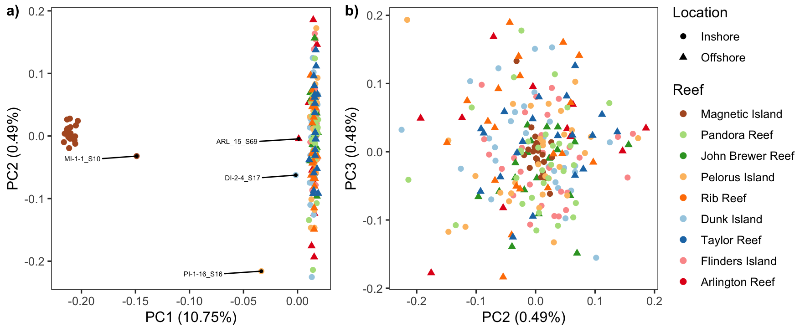
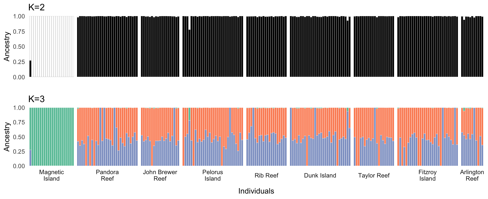
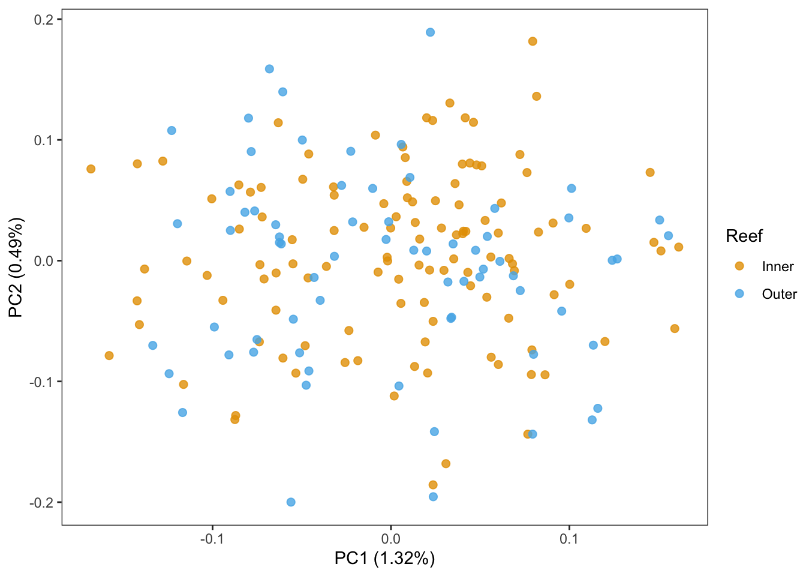

Population structure: PCA analysis and Admixture
================

### PCAngsd analysis

We used PCAngsd to calculate the covariance matrix across all SNPs and
then used the eigen function in R to complete a PCA. In a plot of PC1 vs
PV2 the strongest variance was observed between samples from MI and all
the other north reefs. The samples from all non-Magnetic Island reefs
form a big cluster without any clustering pattern with only internal
genetic diversity reflected along PC2. Admixture coeffients indicated
the presence of 4 potential hybrids, whose position in the PCA was
between the two clusters.

``` bash
pcangsd --beagle atenuis.beagle.gz --threads 48 --admix --admix_auto 10000 --out atenuis.pcangsd
```



**Figure 1:** Principle component analysis of *A. kenti* based on
genotype likelihoods of all variants. Plots display a) PC1 against PC2
and b) PC2 against PC3 with points coloured by reefs and shaped by
location. The text labels in a) indicate the samples identified as
hybrids.


**Figure 2:** Admixture proportions calculated with PCAngsd using the
`auto_admix` option to infer the cluster number as K=2. Asterixes
highlight highly admixed individuals.

### Admixture analysis with NGSAdmix

The individual admixture proportion was also inferred by `NGSAdmix` with
K set to 2 and 3.

``` bash
NGSadmix -likes atenius.ind212.unique_mdust1M.beagle.gz -K 2 -outfiles atenius.ind212.unique_mdust1M.K2 -P 20 -minMaf 0.05 -minInd 100
NGSadmix -likes atenius.ind212.unique_mdust1M.beagle.gz -K 3 -outfiles atenius.ind212.unique_mdust1M.K3 -P 20 -minMaf 0.05 -minInd 100

NGSadmix -likes atenius.ld_pruned_snps.beagle.gz -K 2 -outfiles atenius.ld_pruned_snps.K2 -P 20 -minMaf 0.05 -minInd 100
NGSadmix -likes atenius.ld_pruned_snps.beagle.gz -K 3 -outfiles atenius.ld_pruned_snps.K3 -P 20 -minMaf 0.05 -minInd 100
```

The results from all snps are presented here.



**Figure 3:** Ancestry proportions estimated in NGSadmix for K=2 (top)
and K=3 (bottom). The mixed bars represent individuals with mixed
ancestry profiles with different proportions.

### PCA on non-Magnetic Island Samples

To explore possible structure between inshore and offshore reefs in the
non-Magnetic Island population we performed PCAngsd analysis based only
on 187 samples from non-Magnetic Island reefs and excluding all hybrids
identified above.

In order to run this analysis we first needed to rerun ANGSD with the
reduced number of samples

``` bash
angsd -bam all_187_bam.list -ref ${ref} -anc ${ref} -C 50 \
    -GL 2 -doGlf 2 -sites ${bed} -doMaf 1 -doCounts 1 -minQ 30 -minMapQ 30 -skipTriallelic 1 \
    -nThreads 40 -uniqueOnly 1 -doMajorMinor 1  -minInd 100 -minmaf 0.05 -SNP_pval 1e-6 \
    -out north_187_SNPs
```

And then ran `pcangsd` on this as follows

``` bash
pcangsd -b north_187_SNPs.beagle.gz -t 40 -o north_187.pcangsd  --selection --minMaf 0.05 --sites_save
```



**Figure 4:** PCA calculated with PCAngsd for non-Magnetic Island
samples only.

### Population structure by pairwise IBS

We used angsd to estimate the pairwise distance matrix based on IBS and
excluded samples were identified as hybrids.

IBS Values were calculated using ANGSD as follows

``` bash
angsd -GL 2 -out atenius.ind212.unique_mdust1M_depth.ibs -doMajorMinor 1 -doMaf 1 -minmaf 0.05 \
  -b ind212_bam.list -minmapQ 30 -minq 30 -sites reference_mappability_K50_E2.unique_mdust1M_depth.bed \
  -doCounts 1 -doIBS 1 -makeMatrix 1 -minInd 100 \
  -nThreads 40
```

We then used hierchical clustering via the `hclust` package in R to
produce a tree based on IBS distances for all samples and then focussing
purely on non Magnetic Island samples.


**Figure 5:** Dendrograms showing relationships inferred via
hierarchical clustering based on IBS distances. All samples (left) shows
a strong distinction with Magnetic Island while a focus on non-Magnetic
Island shows (right) shows no obvious clustering by reef or by shore
(inshore/offshore).

### Pairwise Fst between reefs

To estimate pairwise Fst between reefs, we first used realSFS to
calculate the site frequency spectrum (SFS) of each reef and 2D SFS of
each pair of reefs using the saf files. realSFS was then used to get the
Fst values between each pair.

``` bash
angsd -bam {pop.bamlist} -ref {ref} -C 50 \
  -GL 2 -doSaf 1 -sites {input.bed} \
  -doCounts 1 -minQ 30 -minMapQ 30 -nThreads {threads} -uniqueOnly 1 -doMajorMinor 1 -out {pop}
  
#Fst
realSFS -P {threads} {pop1}.saf.idx {pop2}.saf.idx -fold 1 > {pop1}-{pop2}.2dsfs
realSFS fst index {pop1}.saf.idx {pop2}.saf.idx -sfs {pop1}-{pop2}.2dsfs -fstout {pop1}-{pop2}
realSFS fst stats {pop1}-{pop2}.fst.idx 
```

Pairwise Fst values were then used to construct a bootstrapped tree
using the ape function `boot.phylo`.


**Figure 6:** Pairwise Fst values calculated between all pairs of
sampling locations. Node labels in tree are bootstrap support values
calculated using `boot.phylo`.
