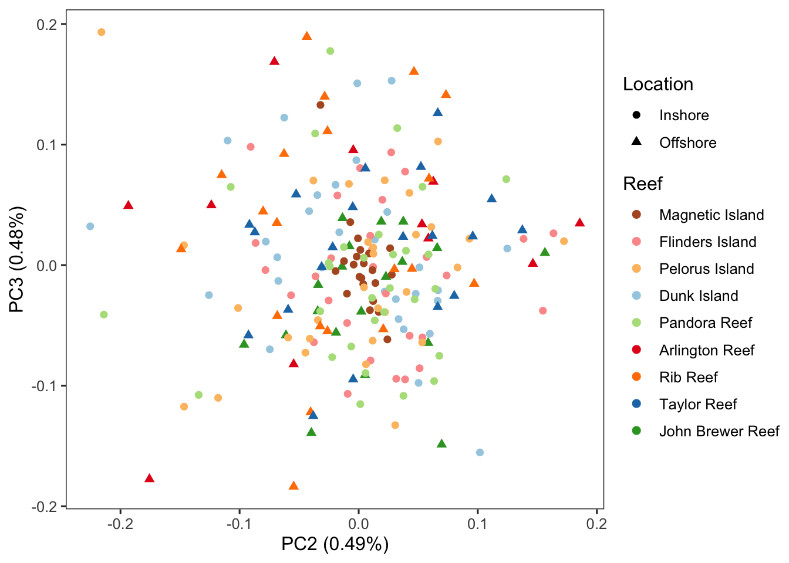
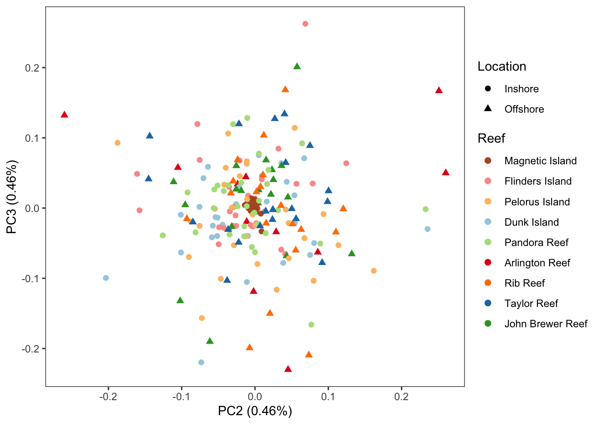
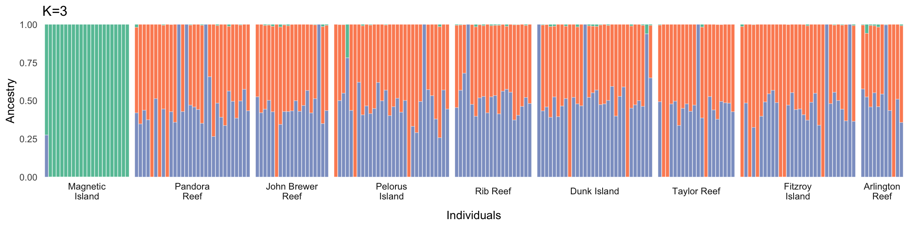

Population structure: PCA analysis and Admixture
================

### PCAngsd analysis

We firstly used pcangsd to calculate covariance of all SNPs and plotted
the first two principles. The strongest variance was observed between
samples from MI and all the other north reefs. The samples from north
reefs seems form a big cluster without any clustering pattern with only
internal genetic diversity reflected along PC2. We also identified 4
potential hybrids, consistently in PCA plot and Admixture plot. These
hybrids were excluded in selection analysis, IBS tree, and demographic
modelling.

``` bash
pcangsd --beagle atenuis.beagle.gz --threads 48 --admix --admix_auto 10000 --out atenuis.pcangsd
```




### LD-Pruned results



A minor discontinuity was in north reefs samples were observed but the
results were similar.


### Admixture analysis

The individual admixture proportion was also inferred by `NGSAdmix` with
K set to 2 and 3.

``` bash
NGSadmix -likes atenius.ind212.unique_mdust1M.beagle.gz -K 2 -outfiles atenius.ind212.unique_mdust1M.K2 -P 20 -minMaf 0.05 -minInd 100
NGSadmix -likes atenius.ind212.unique_mdust1M.beagle.gz -K 3 -outfiles atenius.ind212.unique_mdust1M.K3 -P 20 -minMaf 0.05 -minInd 100

NGSadmix -likes atenius.ld_pruned_snps.beagle.gz -K 2 -outfiles atenius.ld_pruned_snps.K2 -P 20 -minMaf 0.05 -minInd 100
NGSadmix -likes atenius.ld_pruned_snps.beagle.gz -K 3 -outfiles atenius.ld_pruned_snps.K3 -P 20 -minMaf 0.05 -minInd 100
```

The results from all snps were presented here.


