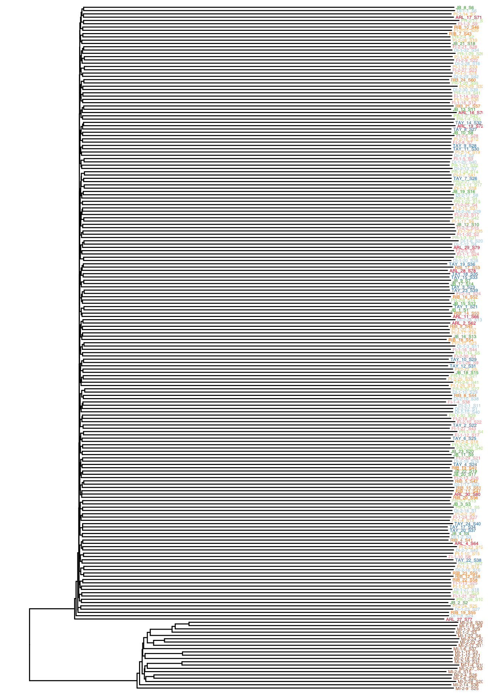
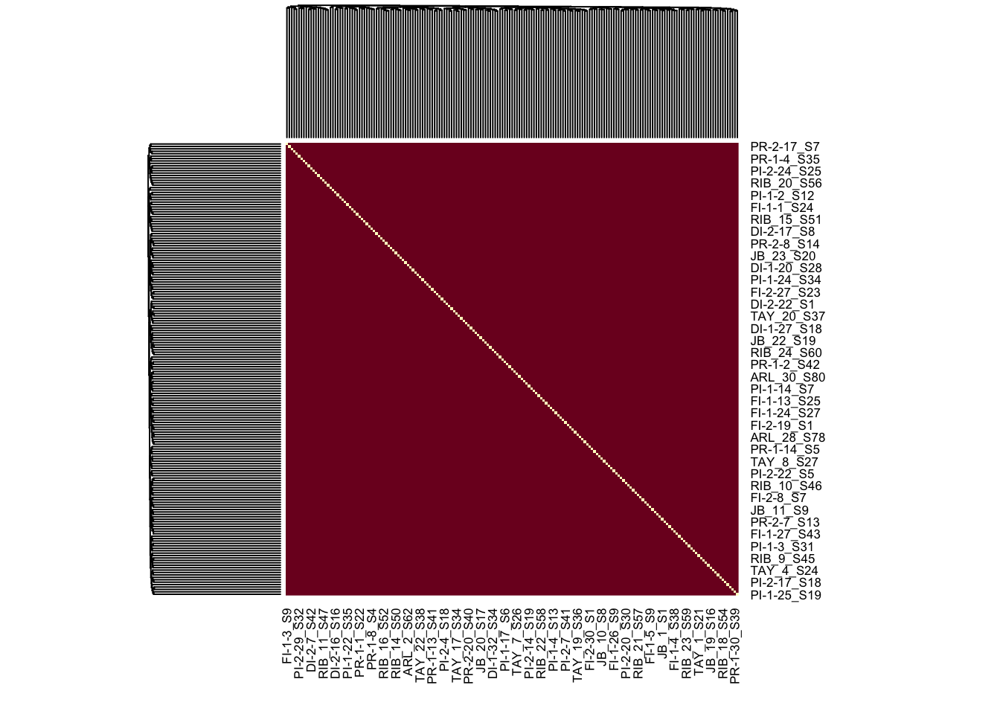

IBS tree
================

We used angsd to estimate the pairwise distance matrix based on IBS and
excluded samples were identified as hybrids for makeing NJ tree.

We also used this iBS matrix in EEMS excluding samples from Magnetic
Island. However, these is not big variation in ibs distances.

