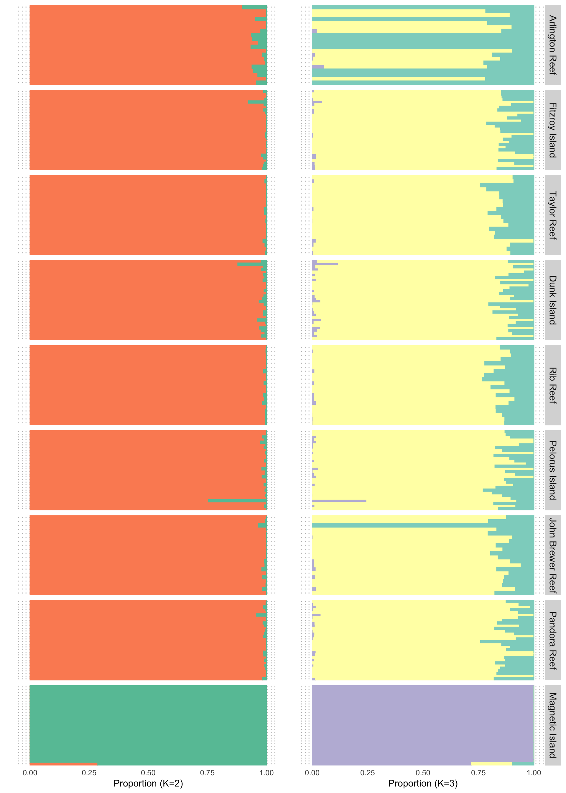
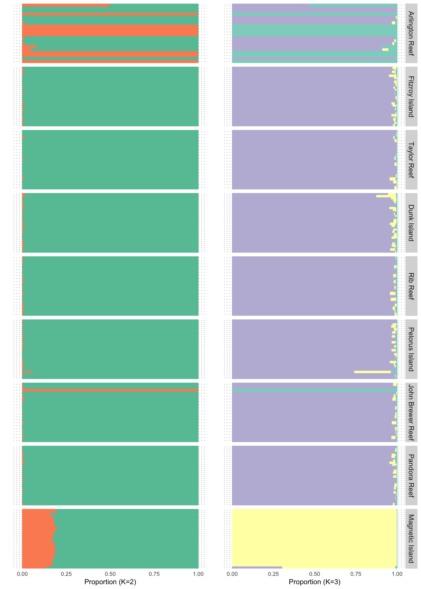
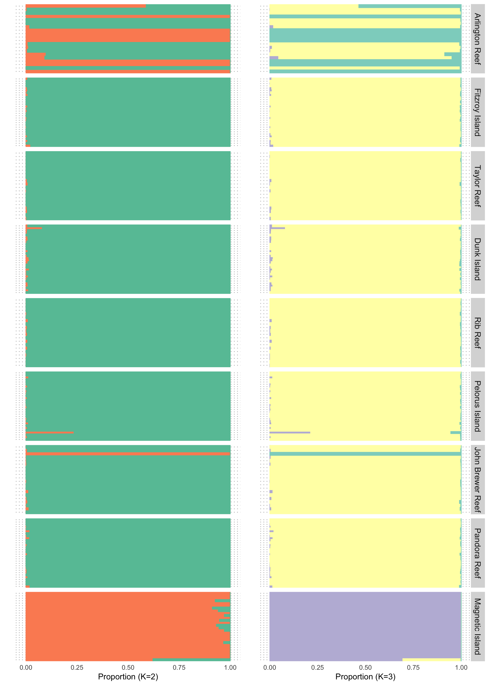
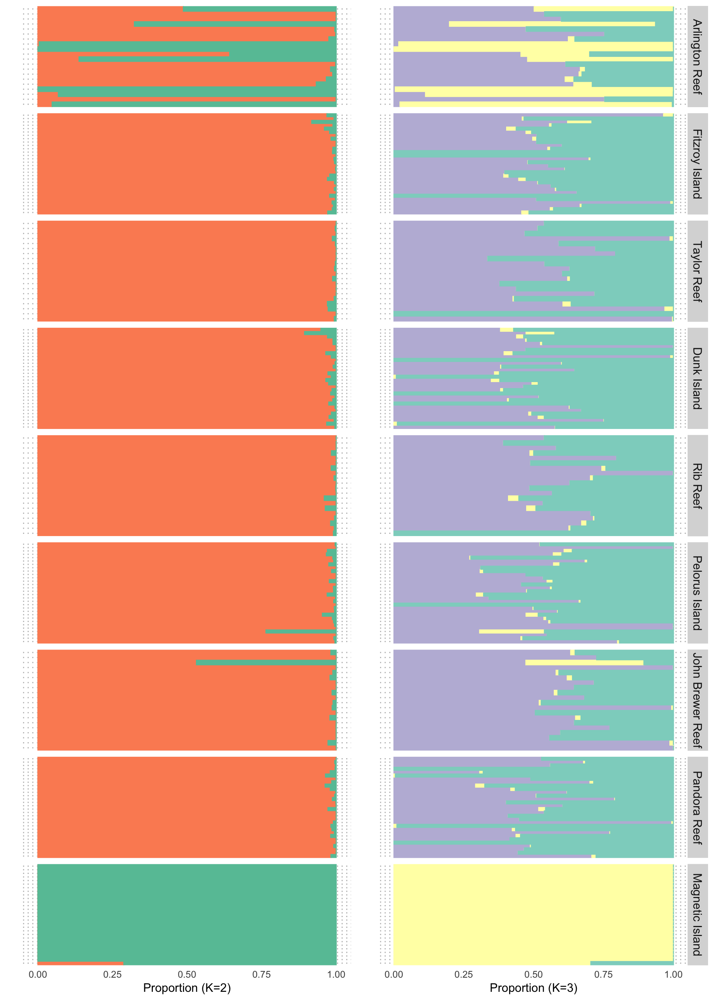
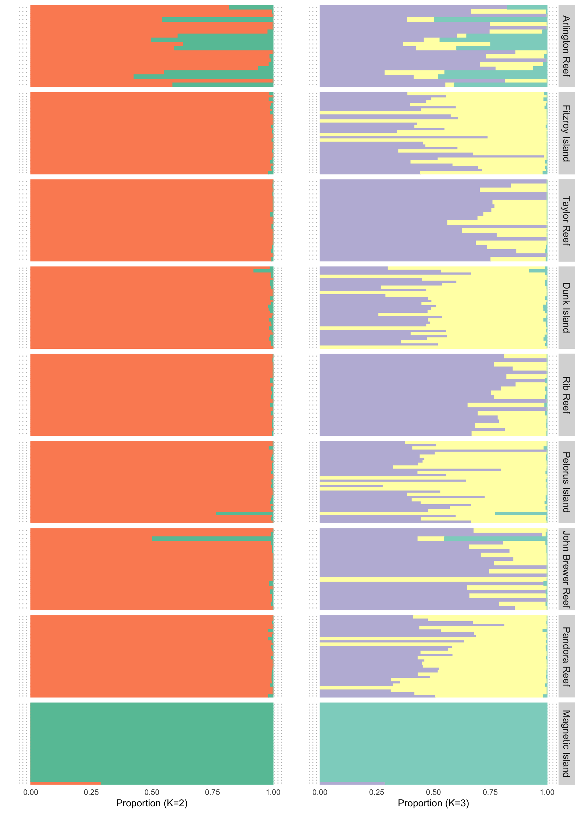

Admixture analysis
================

PCA anlaysis showed that all samples form three groups with one main
group including most samples and one group composed of samples from
magnetic island and a small group including several samples from
Arlington reef and one from John Brewer Reef. Here, we infered the
genetic admixture proportion of each individual. Same, we used genotype
likelihood data that we used in PCA analysis, to keep it consistent, we
also used whole-genome snps, LD pruned snps, and snps filtered by
population specific missing data.

We used `NGSadmix` v32 to infer individual’s ancestry while considering
the uncertainty in genotypes with number of clusters setted to 2 and 3.

``` bash
NGSadmix -likes atenius.beagle.gz -K 2 -outfiles atenius.K2 -P 20 -minMaf 0.05 -minInd 114
NGSadmix -likes atenius.beagle.gz -K 3 -outfiles atenius.K3 -P 20 -minMaf 0.05 -minInd 114
```

### 1. Admixture based on all SNPs



### 2. Admixture based on sites with \< 50% missing data in each population

see how we get this dataset in [PCA analysis](04.PCA_analysis.md)



When using this dataset, it seems exaggerate/emphasis the divergence in
Arlington reef subgroup (consistent with PCA), and the magnetic island
seems to be hybrids at K=2. I think this is because samples from
magnetic island all have lower genome mapping coverage, so eventually,
we only kept \~500k snps that are shared in all populations. However,
the divergence of magnetic island samples also come from those unmapped
regions (could be too divergent to map?) and this was very different
from others.

### 3. Admixture based on unlinked SNPs



This gave similar results, when using unlinked snps, the separation
seems to be stronger. Very unexpected.Dose this mean their genomes
shared some large segements homozygousity while rest is diverging?

What are those regions? Those keep them breeding?

### Using recalibrated bam files in site restricted analysis

**1.popmiss05**



**2.LD_pruned**


