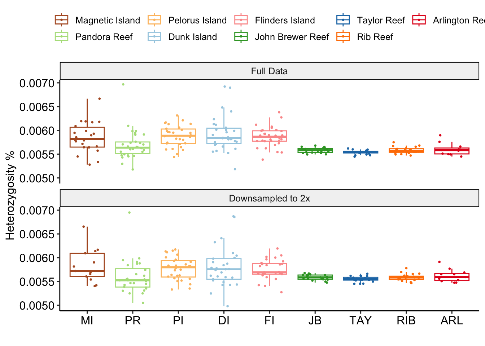

Investigating potential batch effects
================

All samples in this study were sequenced with the same sequencing
technology, same read length and at approximately the same overall
depth. In addition, as shown in analyses of [population
structure](04.population_structure.md) no difference between inshore and
offshore samples was observed in PCA or in a tree based on IBS
distances. Nevertheless we did observe some consistent differences
between inshore and offshore samples that might indicate a subtle batch
effect.

The first of these differences was in individual heterozygosity
estimates. To calculate individual heterozygosities we first ran `angsd`
for each sample individually. Running `realSFS` on these individual
allele frequency files provides an estimate of the number of
heterozygous sites (AF=0.5) and we can obtain the heterozygosity by
dividing this by the total number of sites. To a first approximation the
total number of sites is simply equal to the number of sites with AF=0.

``` bash
for sample in samples;do
angsd -i $i -ref ${ref} -anc ${ref} -C 50 \
    -GL 2 -doSaf 1 \
    -sites ../reference_mappability_K50_E2.unique_mdust1M_depth.bed \
    -doCounts 1 \
    -setMinDepth 2 -setMaxDepth 12\
    -minQ 30 -minMapQ 30 -nThreads 15 -uniqueOnly 1 -doMajorMinor 1  -out $sample

    ../../angsd/misc/realSFS -fold 1 -P 15 ${sample}.saf.idx > ${sample}.ml 
done
```

``` bash
for f in *.ml;do s=${f%.ml}; h=$(awk '{print $2/$1}' $f); printf "%s\t%s\n" $s $h;done > hets.tsv
```

We performed this individual heterozygosity calculation for our standard
dataset as well as for data with coverage downsampled to 2x so that all
samples have the same overall depth.


