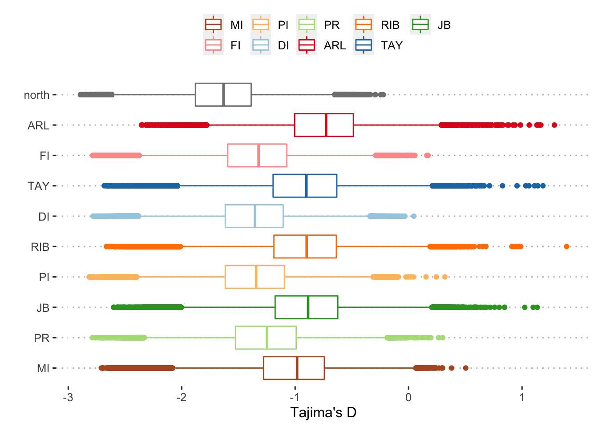
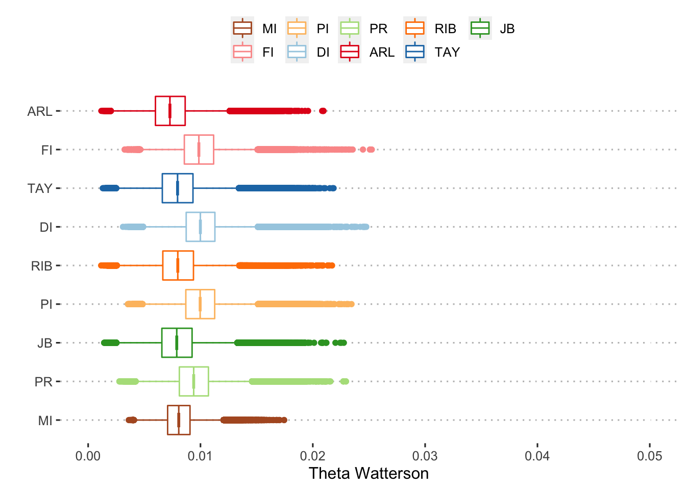
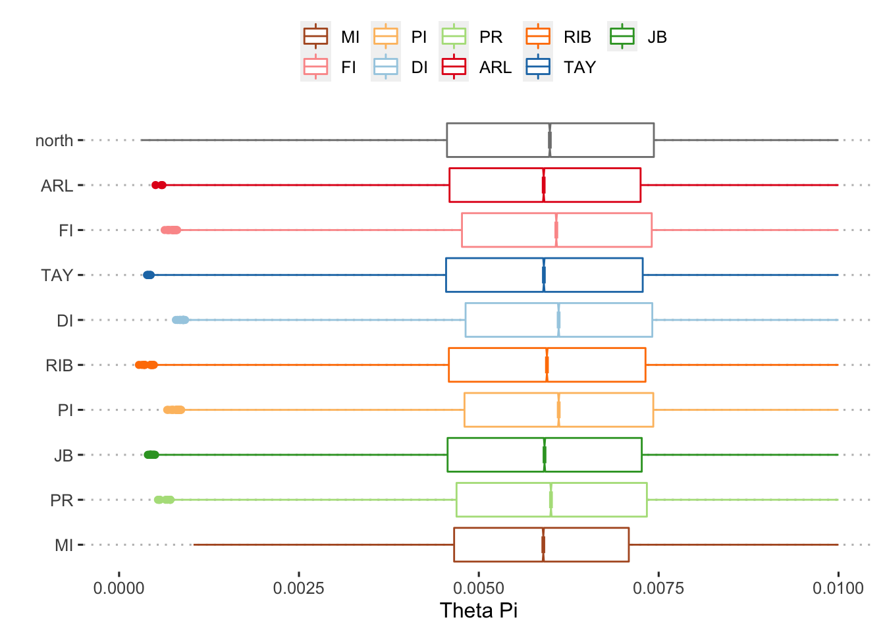
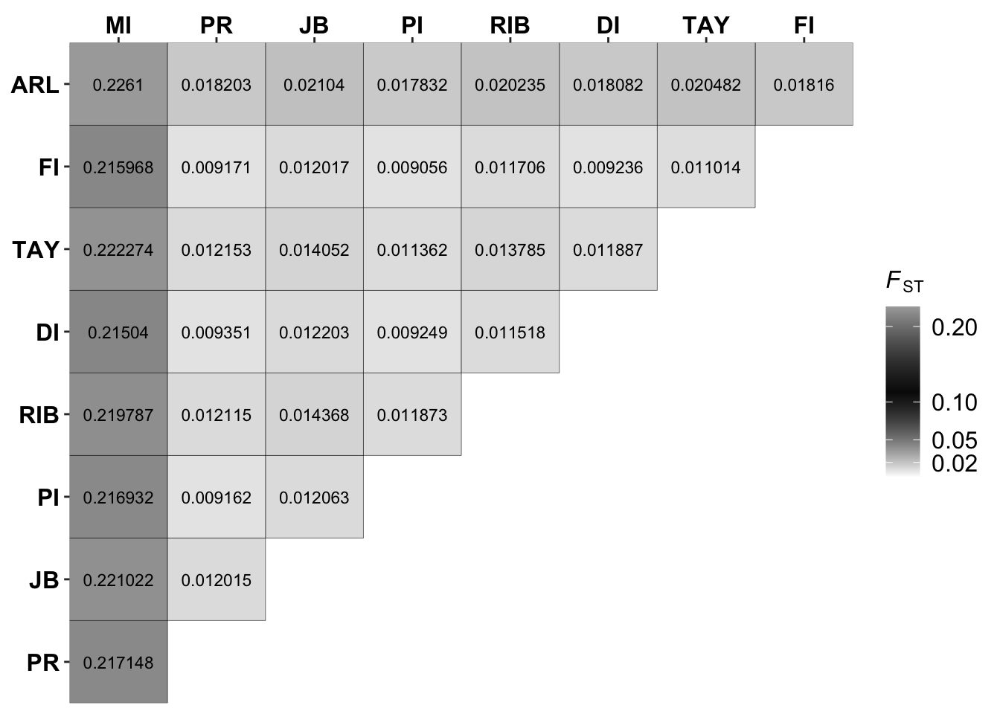
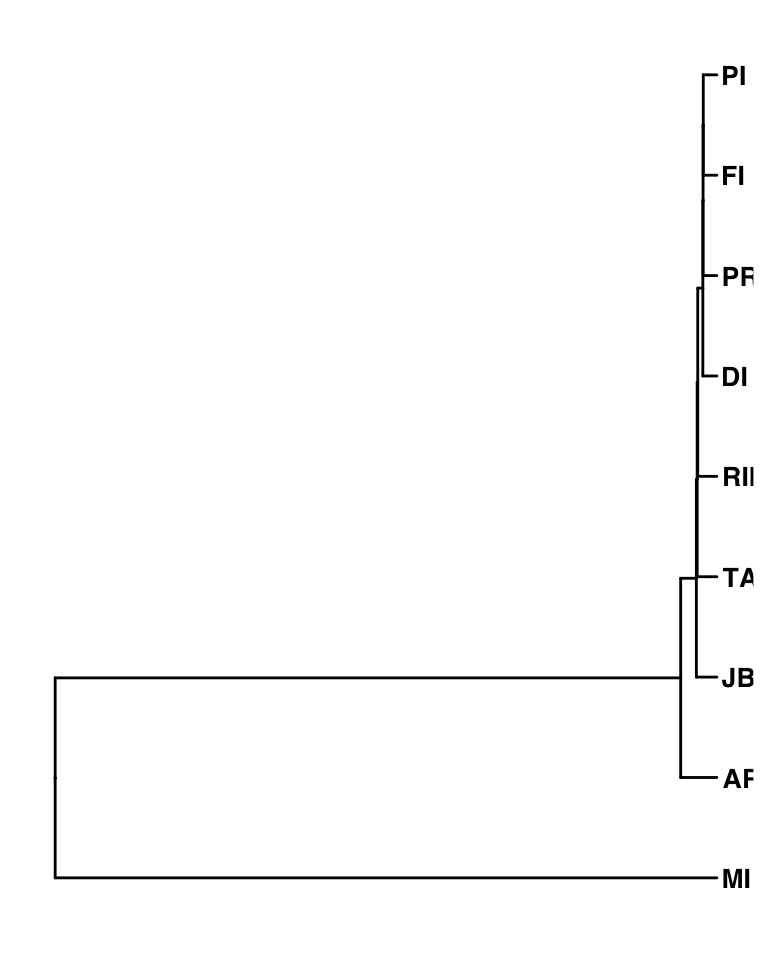
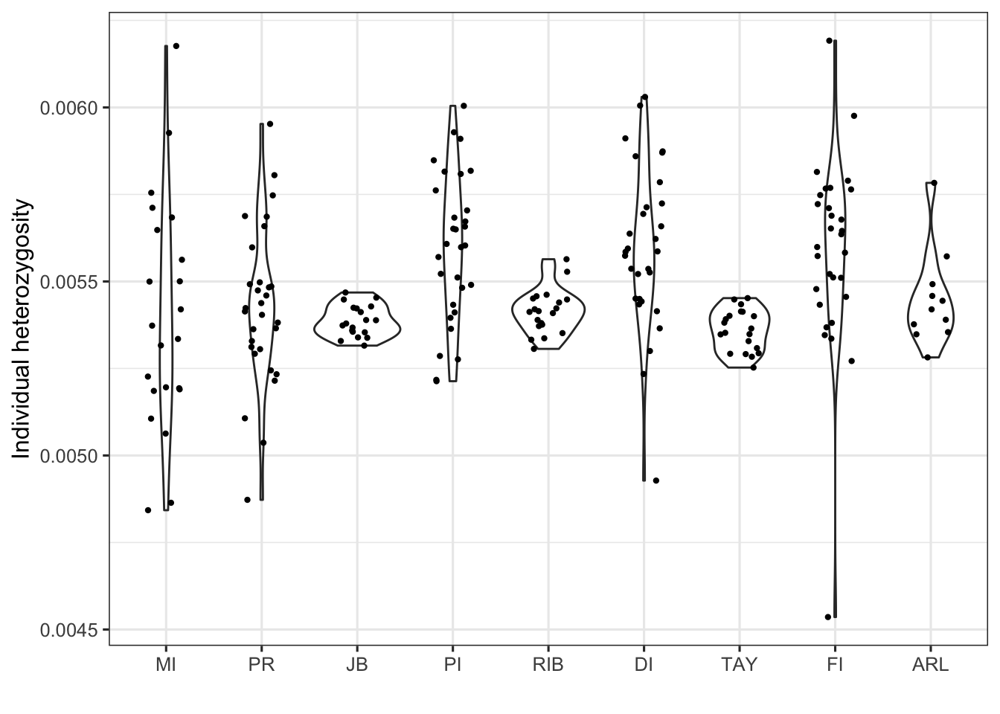

Genetic Statistics
================

To get the estimates of window-based genetic diversity and neutrality
test of our samples, we first used realSFS program to calculate the site
frequency spectrum (SFS) of each reef and 2D SFS of each pair of reefs
using the saf files. The thetaStat within ANGSD was then used to compute
(sliding-window:10k with jump size of 2k) the nucleotide diversity and
tajima’s D, etc. and realSFS was used to get the Fst values between each
pair.

``` bash
angsd -bam {pop.bamlist} -ref {ref} -C 50 \
  -GL 2 -doSaf 1 -sites {input.bed} \
  -doCounts 1 -minQ 30 -minMapQ 30 -nThreads {threads} -uniqueOnly 1 -doMajorMinor 1 -out {pop}
  
#thetastat
realSFS {pop}.saf.idx -fold 1 -P {threads} > {pop}.folded.sfs
realSFS saf2theta {pop}.saf.idx -outname {pop} -sfs {pop}.folded.sfs -fold 1
thetaStat do_stat {pop}.theta.idx -win 10000 -step 2000 -outnames {pop}.thetas_w10ks2k

#Fst
realSFS -P {threads} {pop1}.saf.idx {pop2}.saf.idx -fold 1 > {pop1}-{pop2}.2dsfs
realSFS fst index {pop1}.saf.idx {pop2}.saf.idx -sfs {pop1}-{pop2}.2dsfs -fstout {pop1}-{pop2}
realSFS fst stats {pop1}-{pop2}.fst.idx 
```



    ## # A tibble: 10 × 4
    ##    pop   mean_tw mean_tp mean_td
    ##    <chr>   <dbl>   <dbl>   <dbl>
    ##  1 ARL   0.00737 0.00610  -0.756
    ##  2 DI    0.0101  0.00630  -1.37 
    ##  3 FI    0.00993 0.00628  -1.34 
    ##  4 JB    0.00797 0.00612  -0.910
    ##  5 MI    0.00812 0.00596  -1.03 
    ##  6 north 0.0133  0.00633  -1.63 
    ##  7 PI    0.0100  0.00630  -1.36 
    ##  8 PR    0.00947 0.00619  -1.27 
    ##  9 RIB   0.00807 0.00617  -0.921
    ## 10 TAY   0.00803 0.00613  -0.924

## Pairwise differentiation Fst



Fst tree attempt

    ## Running bootstraps:       100 / 10000Running bootstraps:       200 / 10000Running bootstraps:       300 / 10000Running bootstraps:       400 / 10000Running bootstraps:       500 / 10000Running bootstraps:       600 / 10000Running bootstraps:       700 / 10000Running bootstraps:       800 / 10000Running bootstraps:       900 / 10000Running bootstraps:       1000 / 10000Running bootstraps:       1100 / 10000Running bootstraps:       1200 / 10000Running bootstraps:       1300 / 10000Running bootstraps:       1400 / 10000Running bootstraps:       1500 / 10000Running bootstraps:       1600 / 10000Running bootstraps:       1700 / 10000Running bootstraps:       1800 / 10000Running bootstraps:       1900 / 10000Running bootstraps:       2000 / 10000Running bootstraps:       2100 / 10000Running bootstraps:       2200 / 10000Running bootstraps:       2300 / 10000Running bootstraps:       2400 / 10000Running bootstraps:       2500 / 10000Running bootstraps:       2600 / 10000Running bootstraps:       2700 / 10000Running bootstraps:       2800 / 10000Running bootstraps:       2900 / 10000Running bootstraps:       3000 / 10000Running bootstraps:       3100 / 10000Running bootstraps:       3200 / 10000Running bootstraps:       3300 / 10000Running bootstraps:       3400 / 10000Running bootstraps:       3500 / 10000Running bootstraps:       3600 / 10000Running bootstraps:       3700 / 10000Running bootstraps:       3800 / 10000Running bootstraps:       3900 / 10000Running bootstraps:       4000 / 10000Running bootstraps:       4100 / 10000Running bootstraps:       4200 / 10000Running bootstraps:       4300 / 10000Running bootstraps:       4400 / 10000Running bootstraps:       4500 / 10000Running bootstraps:       4600 / 10000Running bootstraps:       4700 / 10000Running bootstraps:       4800 / 10000Running bootstraps:       4900 / 10000Running bootstraps:       5000 / 10000Running bootstraps:       5100 / 10000Running bootstraps:       5200 / 10000Running bootstraps:       5300 / 10000Running bootstraps:       5400 / 10000Running bootstraps:       5500 / 10000Running bootstraps:       5600 / 10000Running bootstraps:       5700 / 10000Running bootstraps:       5800 / 10000Running bootstraps:       5900 / 10000Running bootstraps:       6000 / 10000Running bootstraps:       6100 / 10000Running bootstraps:       6200 / 10000Running bootstraps:       6300 / 10000Running bootstraps:       6400 / 10000Running bootstraps:       6500 / 10000Running bootstraps:       6600 / 10000Running bootstraps:       6700 / 10000Running bootstraps:       6800 / 10000Running bootstraps:       6900 / 10000Running bootstraps:       7000 / 10000Running bootstraps:       7100 / 10000Running bootstraps:       7200 / 10000Running bootstraps:       7300 / 10000Running bootstraps:       7400 / 10000Running bootstraps:       7500 / 10000Running bootstraps:       7600 / 10000Running bootstraps:       7700 / 10000Running bootstraps:       7800 / 10000Running bootstraps:       7900 / 10000Running bootstraps:       8000 / 10000Running bootstraps:       8100 / 10000Running bootstraps:       8200 / 10000Running bootstraps:       8300 / 10000Running bootstraps:       8400 / 10000Running bootstraps:       8500 / 10000Running bootstraps:       8600 / 10000Running bootstraps:       8700 / 10000Running bootstraps:       8800 / 10000Running bootstraps:       8900 / 10000Running bootstraps:       9000 / 10000Running bootstraps:       9100 / 10000Running bootstraps:       9200 / 10000Running bootstraps:       9300 / 10000Running bootstraps:       9400 / 10000Running bootstraps:       9500 / 10000Running bootstraps:       9600 / 10000Running bootstraps:       9700 / 10000Running bootstraps:       9800 / 10000Running bootstraps:       9900 / 10000Running bootstraps:       10000 / 10000
    ## Calculating bootstrap values... done.

    ## [1] 100 100  99  33  22  31  19  22



We also used realSFS to estimate the allele frequency spectrum of every
individual and the estiamted heterozygosity was calculated by dividing
the total number of sites with the variant sites.

``` bash
angsd -i $i -ref ${ref} -anc ${ref} -C 50 \
-GL 2 -doSaf 1 -sites ../reference_mappability_K50_E2.unique_mdust_depth.bed \
-doCounts 1 -minQ 30 -minMapQ 30 -nThreads 15 -uniqueOnly 1 -doMajorMinor 1 -setMinDepth 2 -setMaxDepth 12 -out $sample

realSFS -fold 1 -P 15 ${sample}.saf.idx > ${sample}.ml
```


