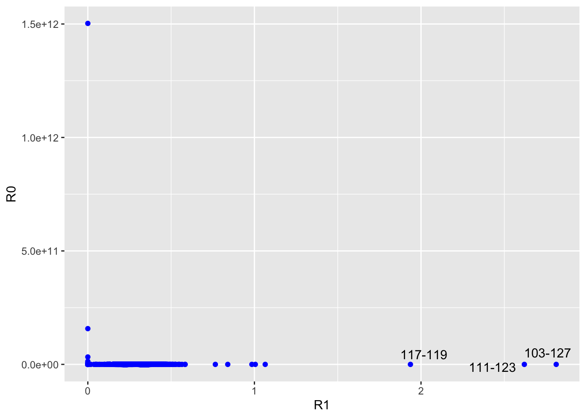
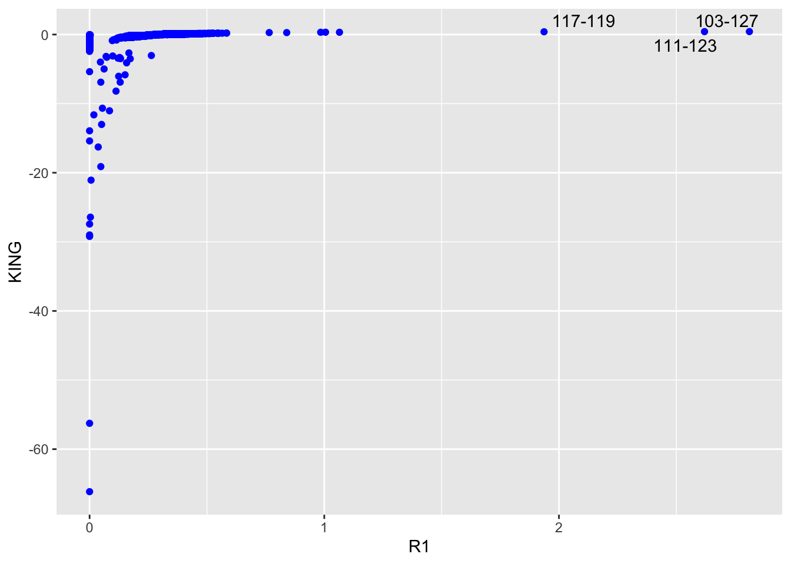
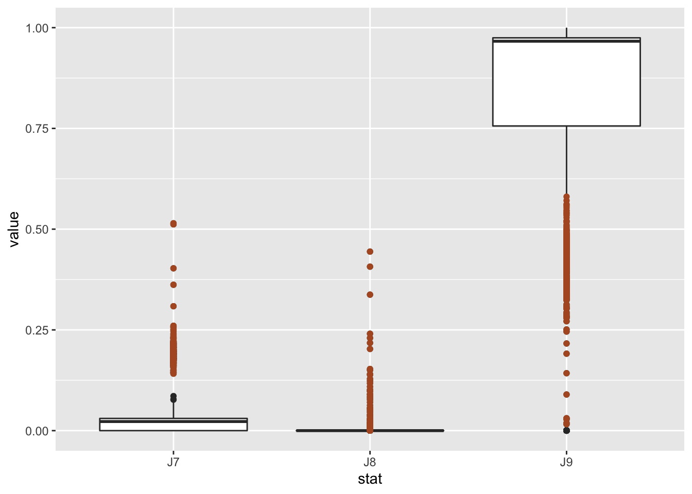

Relatedness from genome-wide IBS
================

To check the kinship of our samples, we used `ngsRelate` to estimated
pairwise relatedness. We used glf format (-doGlf 3), however, vcf files
with PL tage also can be used.

``` bash
zcat atenius.mafs.gz | cut -f 5 |sed '1d' < freq
ngsRelate -g atenius.glf.gz -n 228 -f freq -p 30 -l 0.05 -O atenius.ngsrelate.txt
```

We then plotted the combinations of R0,R1 and R1-KING-robust kinship
statistics of each pair of samples to infer relationships follow the
methods in <https://onlinelibrary.wiley.com/doi/10.1111/mec.14954>.

These outliers are from Magnetic Island , we thus kept one with higher
coverage from each pair in the following analysis.

-   117-119 (MI-2-21_S5, MI-2-24_S36)
-   111-123 (MI-1-6_S37, MI-2-3_S13)
-   103-127 (MI-1-19_S9, MI-2-9_S25)



These samples also have the highest proportion of shared alleles (K2/J7)
between each others. Since they are all from MI, we want to have a look
of the distribution of all sample pairs from MI (points colored in
brown).

**In ngsRelate results, K0==J9; K1==J8; K2==J7, which means the
porportion of genome where they have 0,1,2 alleles shared**



It seems that samples from MI tend to have more shared IBS, are they
suffering from inbreeding?
