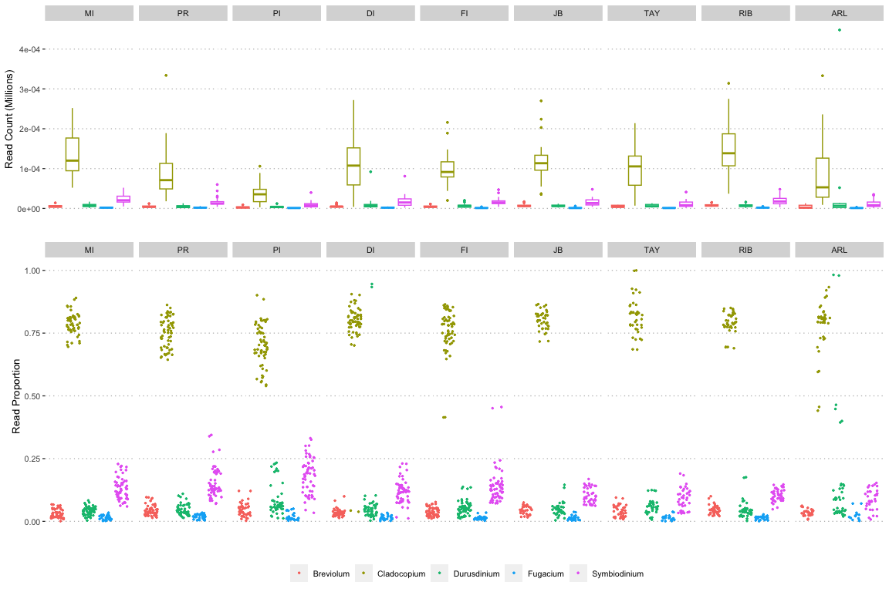
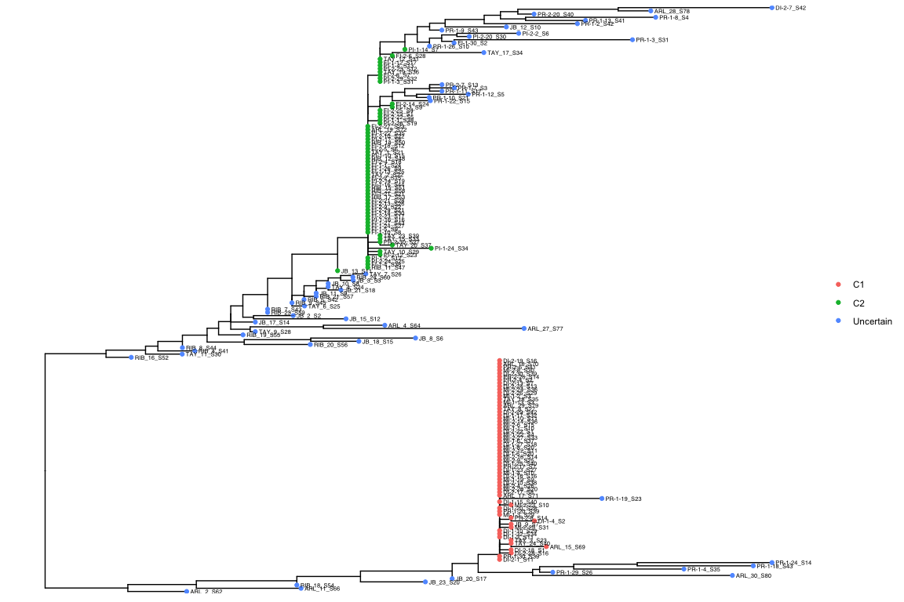
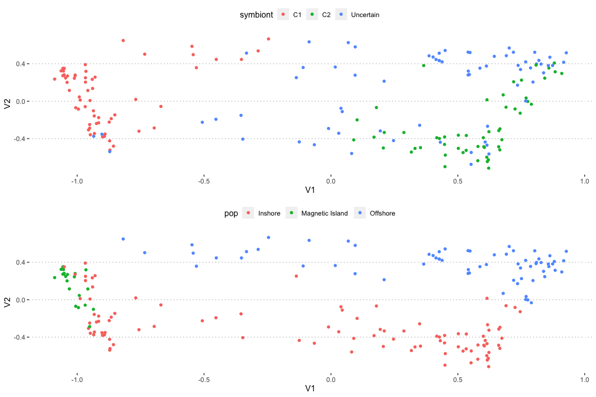

Symbiont Profiles
================

## Genus level analysis using Kraken

The relative abundance of major clades (genera) of Symbiodiniaceae was
profiled using [moqc](https://github.com/marine-omics/moqc)

Irrespective of whether absolute read counts or proportion of reads is
used the dominant symbiont clade for almost all samples was
*Cladocopium*. Two samples from Arlington Reef and two from Dunk Island
were dominated by *Durusdinium*.

<!-- -->

**Figure 1:** Genus level profiles of Symbiodiniaceae present in whole
genome sequencing data of *A. kenti* . Read counts represent numbers of
reads classified by kraken as belonging to the given genus. Read
proportions are relative to reads assigned to the family Symbiodiniaceae
only.

# Diversity within the dominant genus, *Cladocopium*

While the kraken analysis clearly showed that most *A. kenti* samples
are dominated by *Cladocopium*, this is a large and diverse genus. We
therefore undertook additional analyses to search for patterns of
symbiont diversity at lower taxonomic levels.

## Symbiont mitogenome haplotypes

Firstly, reads were extracted from duplicate marked bam files and mapped
to the *Cladocopium* (C1) genome. The symbiont mitogenome sequence was
downloaded from [reefgenomics](http://symbs.reefgenomics.org/download/)
and mapping was performed on all deduplicated reads (including host).

``` bash
samtools fastq -F 1024 {sample}_dpmarked.bam | bam mem -t 12 <mitogenome> - | \
samtools view -b -F 4 > {sample}_mito.bam
```

We then used ANGSD `haplocall` to call haploid consensus sequences from
each bam file. Settings were chosen to obtain the consensus base at each
position (`dohaplocall 2`), only print positions where at least one
variant allele was found (`minMinor 1`) and exclude any positions where
more than 10 individuals have an ambiguous base (`maxMis 10`).

``` bash
../angsd/angsd -bam ind212_symbc_bam.list \
    -dohaplocall 2 -doCounts 1 -minMinor 1 -maxMis 10 \
    -minMapQ 20 -minQ 20 -uniqueOnly 1 \
    -nThreads 8 
```

This resulted in an alignment with 145 variable sites. Further cleaning
with `goalign` removed 29 sequences with more than 4% ambiguous bases.

``` bash
cat AllHaps.fasta | \
    sed 's/_downsampled_3X//' |\
  goalign clean seqs --char=N -c 0.04 | goalign clean sites --char=N -c 0.04 > AllHapsClean.fasta
```

We then converted this to nexus file, encoding the reef as a trait. To
do this we first generated a traits file in R and then ran a custom
[python script](scripts/fasta2nexus.py) to generate nexus format

``` bash
fasta2nexus.py AllHapsClean.fasta -t traits_reef.txt > AllHapsClean.nex
```

The alignments in Nexus-format were loaded in
[popart](http://popart.otago.ac.nz/index.shtml) to generate haplotype
networks using minimum spanning method.


**Figure 2:** Haplotype network of Cladocopium mitochondrial sequences
in 183 coral samples

To more easily classify samples according to their dominant symbiont we
built a tree with `iqtree`

``` bash
iqtree -s AllHapsClean.fasta -m TEST -bb 1000
```

<!-- -->

This allows us to extract representatives of the two major haplogroups
which we label `C1` and `C2` after Abrego, VAN Oppen, and Willis (2009)
. Since it is also possible that other divergent clades might be present
we focus only on those samples where the dominant clade can be clearly
identified as belonging to one of these haplogroups. Individual samples
with long branches and members of divergent clades are therefore
excluded.

## Distance based on D2S statistics

To further make use of symbiont reads in our data, we applied the
`mod2s` pipeline to calculate a d2s matrix

``` bash
nextflow run marine-omics/mod2s -profile genomics -r main --samples symb.csv --outdir symb_d2s --n_reads 100000
```

Based on this matrix, we made MDS plot below. This recapitulates the
major groupings see in the mitohaplotype network analysis but also shows
an inshore/offshore split that may or may-not be due to a batch effect.

<!-- -->

<div id="refs" class="references csl-bib-body hanging-indent">

<div id="ref-Abrego2009-nn" class="csl-entry">

Abrego, David, Madeleine J H VAN Oppen, and Bette L Willis. 2009. “Onset
of Algal Endosymbiont Specificity Varies Among Closely Related Species
of Acropora Corals During Early Ontogeny.” *Mol. Ecol.* 18 (16):
3532–43.

</div>

</div>
