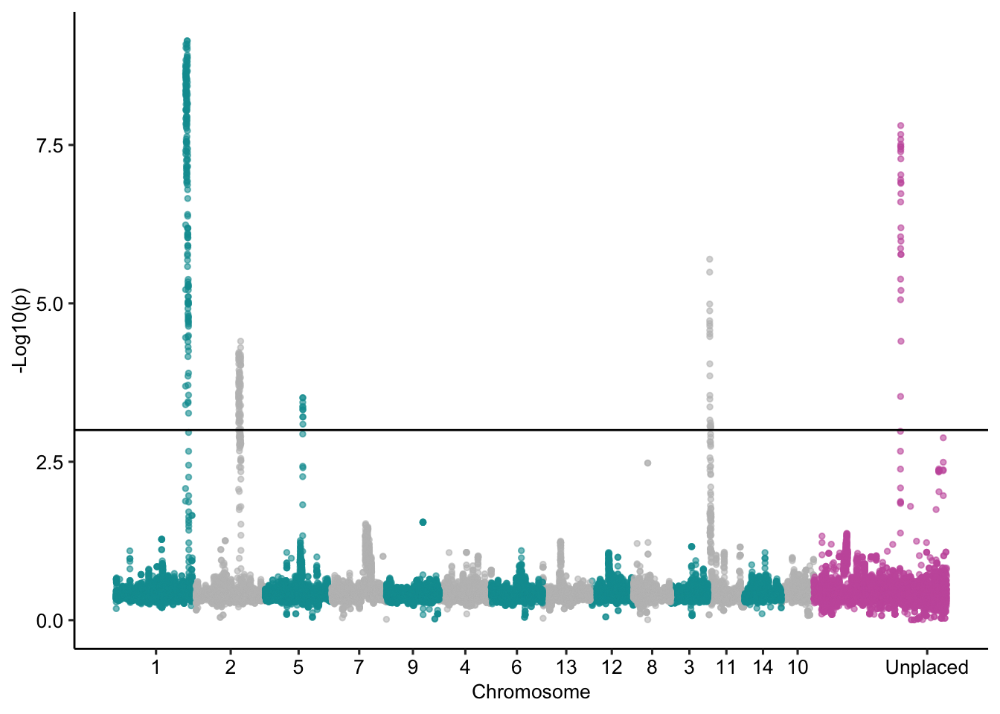
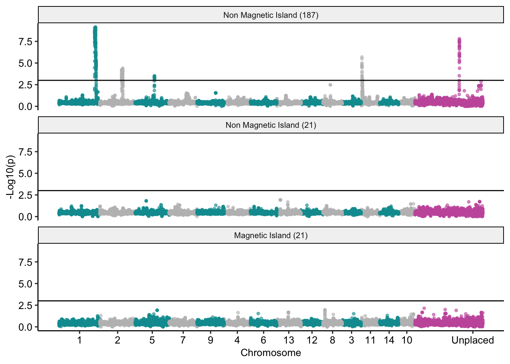

Finding Inversions
================

### Inversions as signatures of local population structure

We used the `-selection` option in
[PCAngsd](https://github.com/Rosemeis/pcangsd) to calculate the Galinsky
statistic for all loci genome-wide. This analysis was performed for all
187 non-Magnetic Island individuals (excluding hybrids) after first
using ANGSD to calculate genotype likelihoods for this subset of the
data.

Data were prepared for PCAngsd using ANGSD as follows

``` bash
angsd -bam all_187_bam.list -ref ${ref} -anc ${ref} -C 50 \
    -GL 2 -doGlf 2 -sites ${bed} -doMaf 1 -doCounts 1 -minQ 30 -minMapQ 30 -skipTriallelic 1 \
    -nThreads 40 -uniqueOnly 1 -doMajorMinor 1  -minInd 100 -minmaf 0.05 -SNP_pval 1e-6 \
    -out north_187_SNPs
```

And then PCAngsd was run using the resulting genotype likelihoods

``` bash
pcangsd -b north_187_SNPs.beagle.gz -t 40 -o north_187.pcangsd  --selection --minMaf 0.05 --sites_save
```

This results in outputs in `.npy` format. We read these into R using the
`npyLoad` function of the `RcppCNPy` package. Since the Galinsky
statistic is Chi Square distributed we calculated a p-value using the
`pchisq` function in R for each variant and wrote this back out to a
text file.

We then converted coordinates for this file into pseudochromosome
coordinates using RagTag.

``` bash
cd data/inshore_offshore/
python ../../scripts/translate_coords.py north_187.selection.txt ../ragtag/ragtag.scaffold.agp > north_187.selection.ragtag.txt
```

In order to smooth and reduce the size of the data we used bedtools to
calculate average p-values within 100kb windows with a 10kb slide.
Smoothed data was qualitatively similar to non-smoothed data but smaller
in volume and had slightly reduced background noise.

``` bash
# Convert PCAngsd galinsky results to bed format and transform p-value into -log10(p)
cat north_187.selection.ragtag.txt | awk '{OFS="\t";print $1,$2,$2,-log($4)/log(10)}' > north_187.selection.ragtag.bed

# Sort bed file for use with bedtools
bedtools sort -g ../ragtag/ragtag.scaffold.genome -i north_187.selection.ragtag.bed > north_187.selection.ragtag.sorted.bed

# Use bedtools map to calculate an average over sliding windows
bedtools map -g ../ragtag/ragtag.scaffold.genome -a ../ragtag/ragtag.scaffold.w100s10.bed -b north_187.selection.ragtag.sorted.bed -c 4 -o mean  | awk '$4!="."' > north_187.selection.w100s10.bed
```



**Figure 1:** Manhattan plot of the selection statistics from PCAngsd
applied to north GBR samples. Using a p-value threshold of p\<0.001
(horizontal line) delineates the five inversions discussed in the paper.

### Delineating inversion boundaries.

First we used a custom [python script](scripts/sf2gff.py) to find all
genomic regions with -log10(p) greater than our threshold of 3 and
export this to gff format.

``` bash
sf2gff.py -t 3 north_187.selection.w100s10.bed > north_187.selection.ragtag_inversions.gff
```

We then converted coordinates for these intervals back to the original
(non RagTag) genomic coordinate system.

``` bash
# Translating coordinates from ragtag back to original for the significant intervals
paste north_187.selection.ragtag.txt north_187.selection.txt | awk '{printf("%s\t%s\t%s\t%s_%s\n", $1,$2,$2,$5,$6)}' > north_187.selection.coordtrans.bed

bedtools intersect -a north_187.selection.ragtag_inversions.gff -b north_187.selection.coordtrans.bed -wo > north_187.selection.ragtag_inversions_original.txt


grep 'chr1_' north_187.selection.ragtag_inversions_original.txt  | awk '{print $13}' | awk -F "_" '{OFS="\t";print $1,$2,$2+1}' > L1.positions.txt

grep 'chr2_' north_187.selection.ragtag_inversions_original.txt  | awk '{print $13}' | awk -F "_" '{OFS="\t";print $1,$2,$2+1}' > L2.positions.txt

grep 'chr11_' north_187.selection.ragtag_inversions_original.txt  | awk '{print $13}' | awk -F "_" '{OFS="\t";print $1,$2+1}' > L3.positions.txt

grep 'chr5_' north_187.selection.ragtag_inversions_original.txt  | awk '{print $13}' | awk -F "_" '{OFS="\t";print $1,$2+1}' > L5.positions.txt

grep 'Sc0000151_' north_187.selection.ragtag_inversions_original.txt  | awk '{print $13}' | awk -F "_" '{OFS="\t";print $1,$2+1}' > L4.positions.txt 

for f in L*.positions.txt;do
    bedtools groupby -i ${f} -g 1 -c 2 -o min,max > ${f%.positions.txt}.bed
done
```

At the end of this process we have the following coordinates for
inversions

    ## # A tibble: 11 × 4
    ##    scaffold      start     end inversion
    ##    <chr>         <dbl>   <dbl> <chr>    
    ##  1 Sc0000013   1280926 3136890 L1       
    ##  2 Sc0000185      5416  350840 L2       
    ##  3 xpSc0000413  105835  107257 L2       
    ##  4 Sc0000185       274    4049 L2       
    ##  5 xpSc0000413     448   87615 L2       
    ##  6 Sc0000097    715974 1527772 L2       
    ##  7 Sc0000121     42191   92220 L3       
    ##  8 Sc0000135    275605  880609 L3       
    ##  9 Sc0000214       346  243717 L4       
    ## 10 xpSc0000409    2407   93281 L5       
    ## 11 xpSc0000466     685   50098 L5

### Inversion signatures at Magnetic Island

After removing hybrids and close kin only 21 samples were available for
analysis at Magnetic Island. Running the ANGSD and PCAngsd analysis for
this cohort did not show any outlier peaks of local genetic structure,
however, given the very low sample size this may not be an indicator
that the inversion are absent in the Magnetic Island population.

To check the effect of sample size on our ability to detect inversions
we performed ANGSD and PCAngsd analysis on a random subset of 21
individuals.



**Figure 2:** Manhattan plots showing signals of local genetic structure
in the A. kenti genome. Horizontal line in each plot shows a p=0.001
significance threshold. Top plot shows the results for all non-hybrid
individuals in the non-Magnetic Island population, for which five highly
significant peaks are present. Bottom two plots show a lack of
significance at Magnetic Island (21 samples) and a random subset of 21
individuals from the non-Magnetic Island population.
