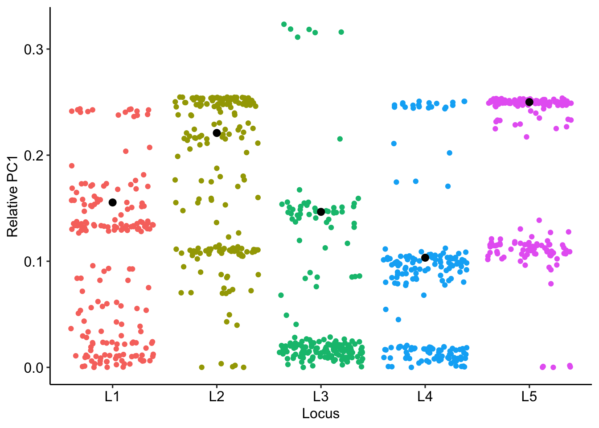
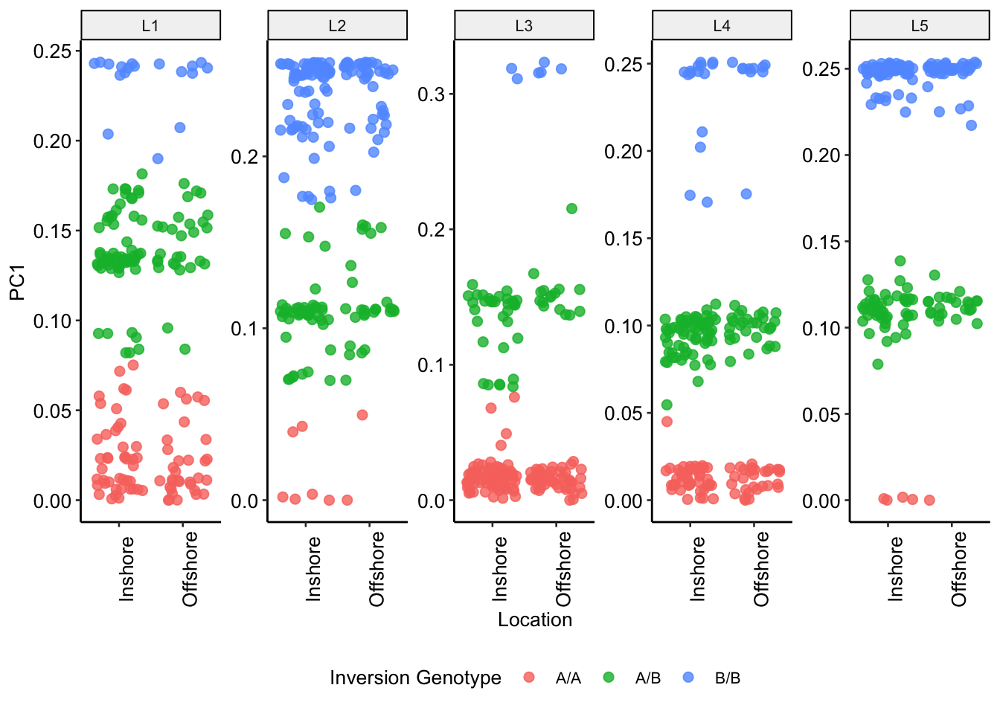

Genotyping Inversions
================

### Local population structure within inversions

After performing an initial genome-wide PCAngsd analysis to identify
inversion locations we reran PCAngsd analyses using data within each
inversion region in turn.

To run PCAngsd within inversions we first extracted the relevant subset
of genotype likelihood data for each inversion in turn.

``` bash
bedtools intersect -u -b <(cat L*.bed) -a <(zcat north_187_SNPs.beagle.gz | awk '{split($1,a,"_");printf("%s\t%s\t%s\t%s\n",a[1],a[2],a[2]+1,$0)}' | grep -v 'marker') > north_187_SNPs_invsites.txt

for Lx in L1 L2 L3 L4 L5;do 
    cat <(zcat north_187_SNPs.beagle.gz | head -n 1) <(bedtools intersect -u -b ${Lx}.bed -a north_187_SNPs_invsites.txt | cut -f 4-) | gzip > ${Lx}.beagle.gz; 
done
```

We then ran PCAngsd separately for each of these datasets. In this
instance we are only interested in the covariance matrix so `-selection`
options are not used.

``` bash
for Lx in L1 L2 L3 L4 L5;do pcangsd -b ${Lx}.beagle.gz -o ${Lx}.pcangsd -t 20;done
```



## Inference of Inversion Genotypes

Inversions give rise to a characteristic pattern of genetic structure
when PCA is applied to SNPs within the inversion region. This structure
groups samples into three clusters corresponding to three potential
genotypes of the inversion itself, ie A/A, A/B, B/A where A and B
represent the two orientations of the inversion. In cases where the
clusters are clear it is possible to infer the genotypes of samples
according to their cluster membership and thereby investigate basic
genetic properties of the inversion alleles.

To assign samples to clusters we use kmeans clustering (with k=3) based
on position along PC1 and with the initial centers of clusters at
min(PC1), (min(PC1)+max(PC1))/2, max(PC1) for genotypes A/A, A/B and B/B
respectively.

To check that this automatic clustering method produces sensible cluster
assignments we visualise asignments along with the original PC1 data for
all inversion loci as in the plot below.



Having assigned genotypes we then performed two tests. First we tested
to see if overall distribution of genotypes at each locus is in Hardy
Weinberg Equilibrium (HWE). We found no significant deviations from HWE.

HWE Test results

    ##        L1        L2        L3        L4        L5 
    ## 0.1978517 0.5379537 0.6006950 0.7568818 0.1890223

Minor allele frequencies for each locus

    ##        L1        L2        L3        L4        L5 
    ## 0.3449198 0.2299465 0.1657754 0.3743316 0.2139037
