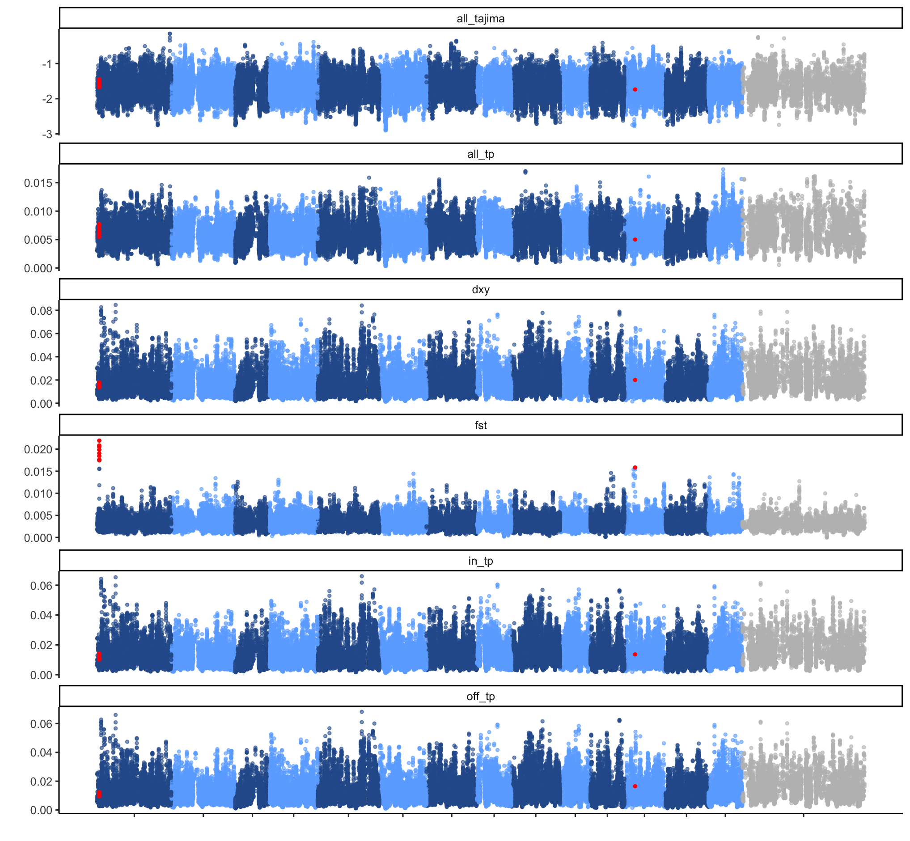
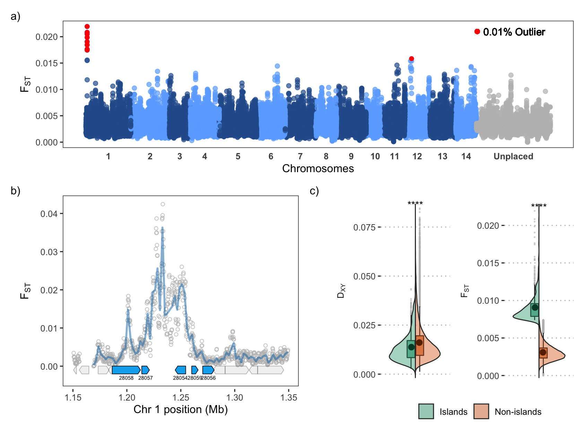
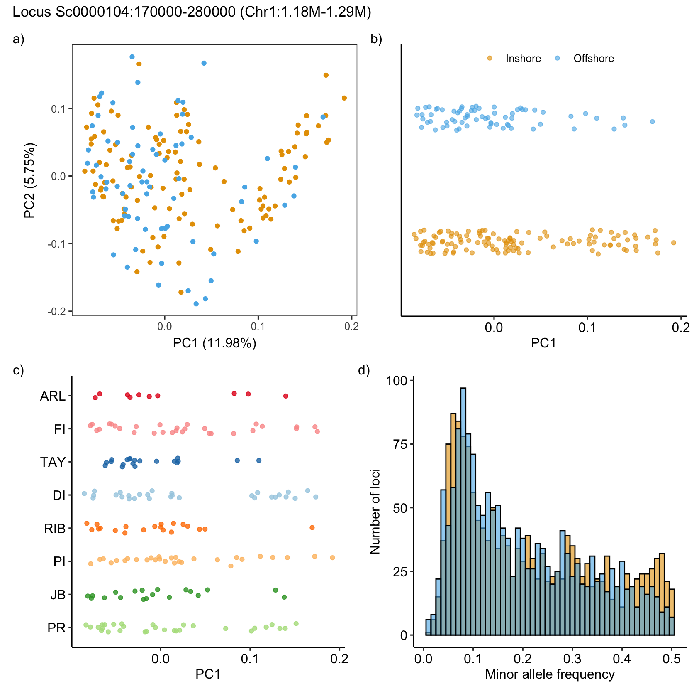
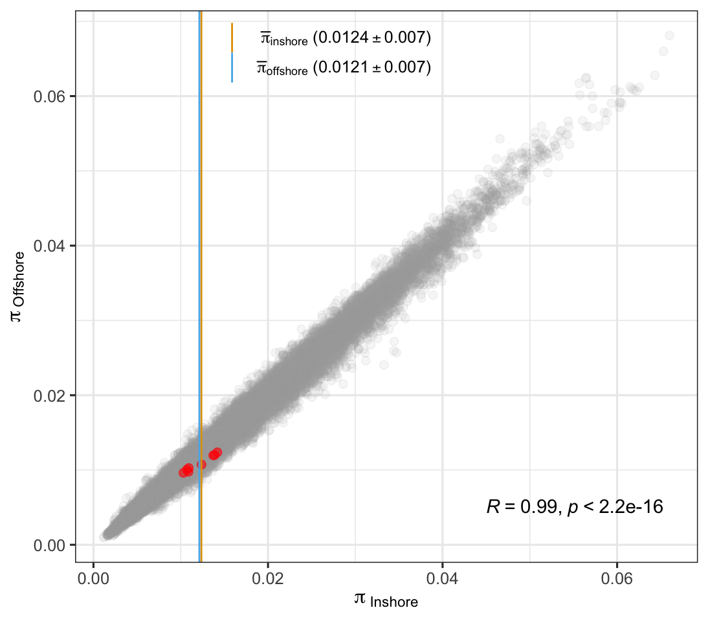

Genomic landscape of genetic diversity between inshore and offshore
corals
================

Despite the strong gene flow among reefs and no structure between
inshore and offshore, we investigate the genome-wide pattern of genetic
diversity between and within inshore and offshore reefs.

## Methods

### 1. Site frequency spectrum estimate for inshore and offshore

In this analysis, we only included samples from the north GBR (118 from
inshore, 69 from offshore) and we used realSFS within ANGSD to estimate
the SFS for each group or pairwise 2DSFS of inshore and offshore. To
make sure some loci were used in analysis, we firstly used ANGSD to
estimate sfs for all 187 samples and set the similar filtering as
before. We got the site index from the mafs file and then we limited the
SFS estimate of inshore and offshore in these sites (202,829,504)
without any further filtering.

``` bash
angsd -bam all_187_bam.list -ref ${ref} -anc ${ref} -C 50 \
       -GL 2 -doSaf 1 -sites ${bed} -doMaf 1 -doCounts 1 -minQ 30 -minMapQ 30 \
       -nThreads 40 -uniqueOnly 1 -doMajorMinor 1 -out north_187_minInd100 -minInd 100

zcat north_187_minInd100.mafs.gz|sed '1d'|cut -f1,2 > north_187_minInd100.sites
angsd sites index north_187_minInd100.sites

angsd -bam inshore118_bam.list -ref ${ref} -anc ${ref} -sites north_187_minInd100.sites \
       -GL 2 -doSaf 1 -doMaf 1 -nThreads 40 -doMajorMinor 1 -out inshore

angsd -bam offshore69_bam.list -ref ${ref} -anc ${ref} -sites north_187_minInd100.sites \
       -GL 2 -doSaf 1 -doMaf 1 -nThreads 40 -doMajorMinor 1 -out offshore
```

### 2. Sliding-window Fst estimate

Next, we used realSFS to do sliding-window statistic of Fst with a
window size of 50kb and a jump size of 10kb through three steps.

1.realSFS was used to generate folded pairwise SFS with inshore and
offshore SAF files. [how to
folded?](https://github.com/ANGSD/angsd/issues/259)

2.generate per-site numerator/denominator of Fst

3.sum numerator and denominator in windows

``` bash
realSFS -P 24 inshore.saf.idx offshore.saf.idx -fold 1 > inshore_offshore.folded.2dsfs
realSFS fst index inshore.saf.idx offshore.saf.idx -sfs inshore_offshore.2dsfs -fold 1 -fstout inshore_offshore
realSFS fst stats2 inshore_offshore.fst.idx -win 20000 -step 4000 -type 1 > inshore_offshore.w50s10.fst
```

### 3. Theta statistics

We used realSFS and thetaStat within ANGSD to generate SFS, to estimate
theta per site and to calculate neutrality test statistics, like
Tajima’s D, etc. in sliding windows for inshore, offshore,and overall,
separately.

``` bash
realSFS inshore.saf.idx -P 24 -fold 1 > inshore.folded.1dsfs
realSFS saf2theta inshore.saf.idx -sfs inshore.folded.1dsfs -outname inshore -fold 1
thetaStat do_stat inshore.thetas.idx -win 20000 -step 4000 -outnames inshore.w20s4.theta -type 1

realSFS offshore.saf.idx -P 24 -fold 1 > offshore.folded.1dsfs
realSFS saf2theta offshore.saf.idx -sfs offshore.folded.1dsfs -outname offshore -fold 1
thetaStat do_stat offshore.thetas.idx -win 20000 -step 4000 -outnames offshore.w20s4.theta -type 1

realSFS north_187_minInd100.saf.idx -P 24 -fold 1 > north.folded.1dsfs
realSFS saf2theta north_187_minInd100.saf.idx -sfs north.folded.1dsfs -outname north -fold 1
thetaStat do_stat north.thetas.idx -win 20000 -step 4000 -outnames north.w20s4.theta -type 1
```

### 4. Dxy calculation

We used a Perl script
[getDxy.pl](https://github.com/mfumagalli/ngsPopGen/blob/9ee3a6d5e733c1e248e81bfc21514b0527da967b/scripts/getDxy.pl)
provided by the
[ngsPopGen](https://github.com/mfumagalli/ngsPopGen/tree/9ee3a6d5e733c1e248e81bfc21514b0527da967b)
toolset to calculate the DXY for every site in the mafs files generated
by ANGSD, non-bi-alleles sites were removed in the calculation. Per-site
DXY values were then grouped into sliding windows from FST estimates and
the average value was assigned as the value for each window using
Bedtools intersect and groupby. Note that only the global distribution
of DXY was used in our results instead of actual values which were
claimed to be overestimated.

``` bash
perl getDxy.pl --pop1maf inshore.mafs.gz --pop2maf offshore.mafs.gz --minInd 1 > inshore_offshore.getDxy.txt

cut -f1,2,3 inshore_offshore.w20s4.fst |sed '1d'|\
perl -F"\t" -nle '@F[0]=~m/(\(\d+,\d+\))(\(\d+,\d+\))\((\d+),(\d+)\).*/g; print join "\t",@F[1],$3,$4, @F[2];' >angsd_fst_window_w20s4.bed

bedtools intersect -a angsd_fst_window_w20s4.bed -b <(awk '{print $1"\t"$2"\t"$2"\t"$3}' inshore_offshore.getDxy.txt) -loj |\
bedtools groupby -g 1,2,3 -c 8 -o mean| awk '{print $1"\t"$2"\t"$4}' > inshore_offshore.w20s4.getDxy.txt
```

Windowed results of all statistics were then converted into our
psedu-chromosome coordinates using
[translate_coords.py](scripts/translate_coords.py).

## Results



**Figure 1:** A genomic landscape of different statistics between/within
the north inshore reefs and offshore reefs. Red dots present the windows
with top 0.01% fst values.

No clear pattern observed from this plot, however, the genome-wide
genetic diversity in inshore and offshore are well aligned suggest their
high correlation. In the thesis, I focused on Fst outliers and inspected
the gene involved in this region (Chr1). Also, I tested whether highly
differentiated regions (defined as genomic islands) are also with
elevated absolute divergence (dxy) which support the hypothesis of
classical “genomic island of speciation” [cruickshank et
al](https://onlinelibrary.wiley.com/doi/full/10.1111/mec.12796). We
compared the dxy values in windows with top 1% of high Fst values and
rest of the genome, windows with data as least of constitute 10% of the
region were included.



**Figure 2:** Genome-wide divergence pattern between the north inshore
reefs and offshore reefs. a) the Manhattan plot of genome-wide Fst
values for overlapped 20kb windows with 4kb step size, red dots
represent the top 0.01% outliers. b) The close-up view of the estimated
Fst calculated in sliding windows of 1kb across the region of chromosome
1 surrounding the outliers. The coding regions of predicted genes were
indicated below and genes within the high Fst region are coloured in
blue with the arrows pointing transcriptional direction. The unique
number id of each gene was used to label each gene for short. c) The
boxplot and split violin plots for measures of relative divergence Fst
and absolute divergence Dxy in the high Fst regions and low Fst regions.

### Genes within this Locus

**Table 1**: The genes located in the Fst outlier region

| gene              | shortid | pfam                                                 | Gene names              | Protein names                                                                                                                                                                      | ipr_go                             | Gene ontology IDs                                                                                                                                                                                                                                                                                                                                            |
|:------------------|:--------|:-----------------------------------------------------|:------------------------|:-----------------------------------------------------------------------------------------------------------------------------------------------------------------------------------|:-----------------------------------|:-------------------------------------------------------------------------------------------------------------------------------------------------------------------------------------------------------------------------------------------------------------------------------------------------------------------------------------------------------------|
| aten_0.1.m1.28054 | 28054   | PF00574.22;PF00106.24;PF13561.5;PF08659.9;PF01370.20 | Clpp                    | ATP-dependent Clp protease proteolytic subunit, mitochondrial (EC 3.4.21.92) (Endopeptidase Clp)                                                                                   | <GO:0004252;GO:0006508>            | <GO:0004176>; <GO:0004252>; <GO:0005739>; <GO:0005759>; <GO:0006515>; <GO:0009368>; <GO:0042802>; <GO:0051117>; <GO:0051260>; <GO:0051603>                                                                                                                                                                                                                   |
| aten_0.1.m1.28056 | 28056   | PF15743.4;PF04508.11;PF14916.5                       | Gpsm2 Lgn Pins          | G-protein-signaling modulator 2 (Pins homolog)                                                                                                                                     | NA                                 | <GO:0000132>; <GO:0000166>; <GO:0001965>; <GO:0005092>; <GO:0005737>; <GO:0005813>; <GO:0005829>; <GO:0005938>; <GO:0007052>; <GO:0008022>; <GO:0016328>; <GO:0019904>; <GO:0031291>; <GO:0032991>; <GO:0042802>; <GO:0043621>; <GO:0051301>; <GO:0051661>; <GO:0060236>; <GO:0070840>; <GO:0097431>; <GO:0097575>; <GO:0099738>; <GO:1904778>; <GO:1905832> |
| aten_0.1.m1.28057 | 28057   | PF08146.11;PF12348.7;PF13646.5                       | HEATR1 BAP28 QnpA-17571 | HEAT repeat-containing protein 1 (Protein BAP28) (Fragment)                                                                                                                        | NA                                 | <GO:0005730>; <GO:0006364>                                                                                                                                                                                                                                                                                                                                   |
| aten_0.1.m1.28058 | 28058   | PF12397.7;PF13646.5;PF02985.21                       | HEATR1 BAP28 UTP10      | HEAT repeat-containing protein 1 (Protein BAP28) (U3 small nucleolar RNA-associated protein 10 homolog) \[Cleaved into: HEAT repeat-containing protein 1, N-terminally processed\] | NA                                 | <GO:0000462>; <GO:0001650>; <GO:0003723>; <GO:0005654>; <GO:0005730>; <GO:0005739>; <GO:0006364>; <GO:0016020>; <GO:0030686>; <GO:0032040>; <GO:0034455>; <GO:0045943>; <GO:2000234>                                                                                                                                                                         |
| aten_0.1.m1.28059 | 28059   | PF01522.20                                           | NA                      | NA                                                                                                                                                                                 | <GO:0005975;GO:0016810;GO:0003824> | NA                                                                                                                                                                                                                                                                                                                                                           |

### Characterise the locus

I checked the PCA result and minor allele frequency based on this locus,
\~chr1_RagTag:1.18M-1.29M (Sc0000104:170000-280000). The number of SNPs
within this regions: 1628



**Figure 3:** Characterisation of Fst outlier. a) PCA analysis based on
SNPs located in the Fst outlier region. b) and c) The distribution of
samples along PC1 by population and location, respectively. d) Histogram
of the minor allele frequency between inshore and offshore.

**PS: notes for myself**



dxy: getDxy.pl 算出来150M sites into windows。 50M sites
因为不是biallelic被忽略了. dxy2: 我的python code算出来200M sites into
windows, including non-biallelic sites

conclusion: it got slightly lower means with all site dxy values (with
non-biallelic sites) than only-biallelic sites(getDxy.pl). However, it
won’t affect the distribution.
我感觉包括了non-biallelic后，那些低dxy的sites更多了，说明那些多出来的sites都是一些divergence不大的位点。it
make sense，在angsd结果中被认为是triallelic一般都是non-common
variant（指出现频率很低）或者sequencing error。这种算出来的值就很低。
