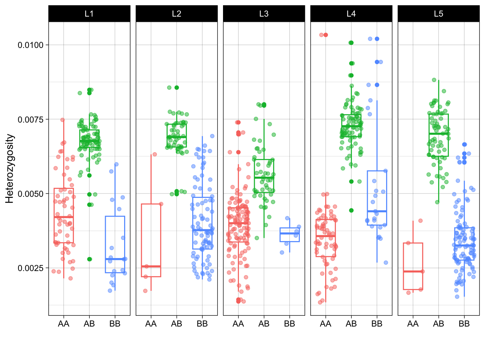

Individual heterozygosity within inversions
================

Our genome-wide scan based on PCA revealed local regions significantly
structuring the populations within samples from the north reefs (except
Magnetic Island). The PCA plots of these regions display three clusters.
Here, we examined the individual heterozygosity of samples in each
cluster.

Angsd was used again to estimate saf and calculate the number of
heterozygous sites within regions.

First mappable sites within regions were identified and indexed

``` bash
bedtools subtract -a ${locus}.bed -b $bed | bedtools sort > ${locus}_mappable.sites
../angsd/angsd sites index ${locus}_mappable.sites
```

Then ANGSD and realSFS were used to calculate heterozygosity

``` bash
../angsd/angsd -i $i -ref ${ref} -anc ${ref} -C 50 \
    -GL 2 -doSaf 1 \
    -sites ${locus}_mappable.sites \
    -doCounts 1 \
    -setMinDepth 2 -setMaxDepth 12\
    -minQ 30 -minMapQ 30 -nThreads 15 -uniqueOnly 1 -doMajorMinor 1  -out hets/${sample}_${locus}

../angsd/misc/realSFS -fold 1 -P 15 hets/${sample}_${locus}.saf.idx > hets/${sample}_${locus}.ml
```

Results for all loci and all individuals are captured in `all_het.tsv`

``` bash
for f in *.ml;do bn=$(basename $f); s=${bn%.ml}; h=$(awk '{print $2/$1}' $f); printf "%s\t%s\n" $s $h;done > all_het.tsv
```


