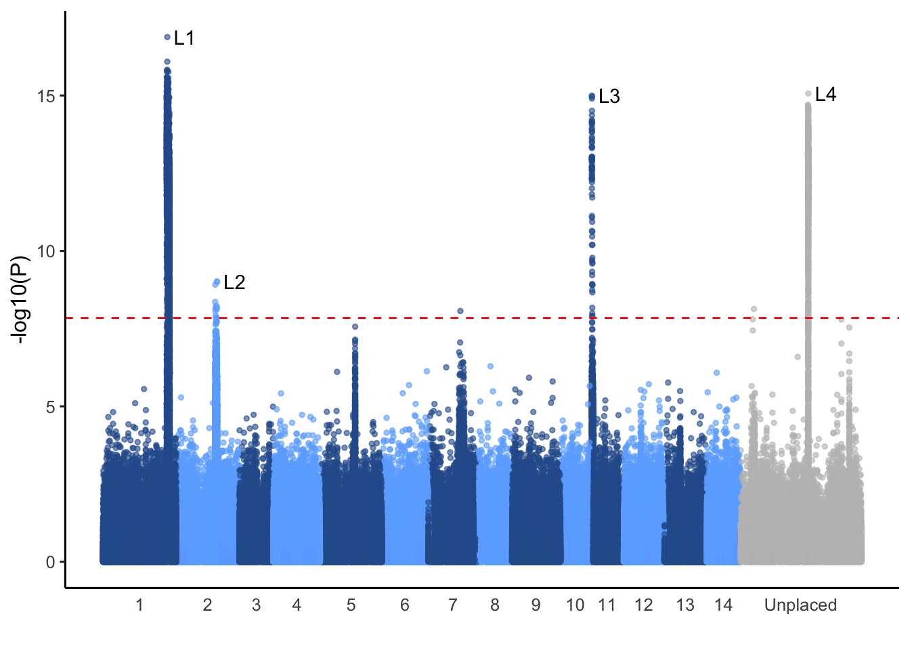
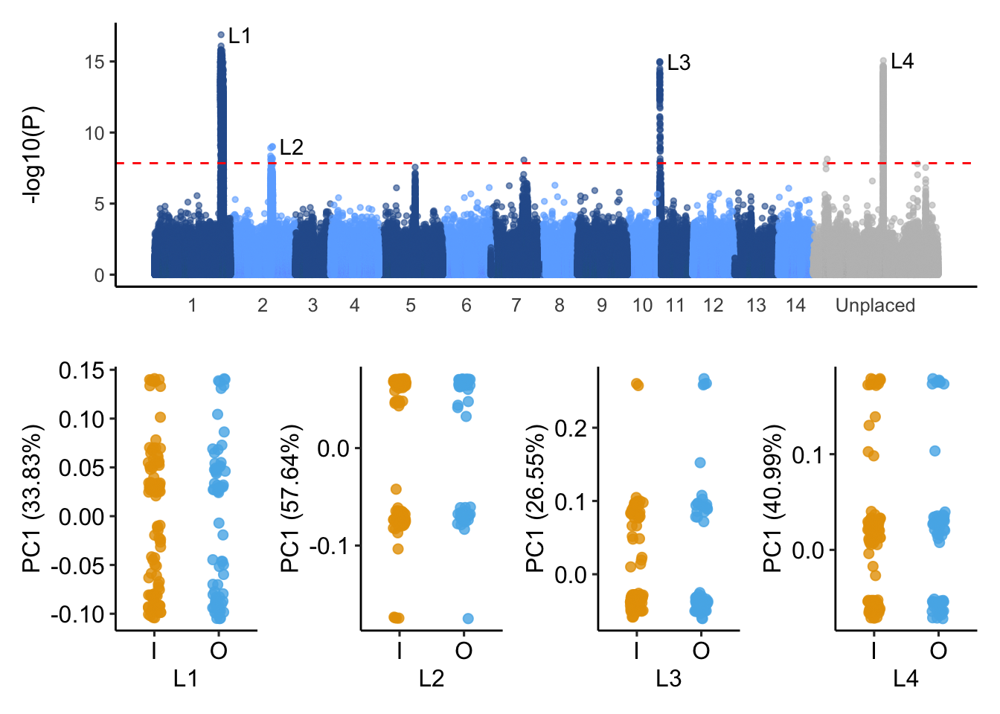
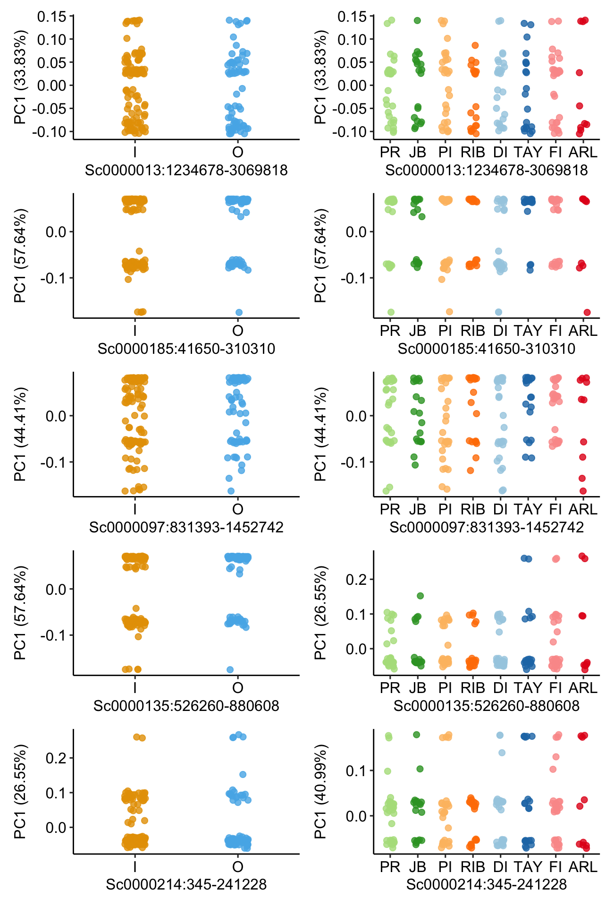

Outlier of differention based on PCA (PCAngsd)
================

We used PCAngsd to scan for any SNP outlier in the north GBR of our
samples

``` bash
angsd -bam all_187_bam.list -ref ${ref} -anc ${ref} -C 50 \
        -GL 2 -doGlf 2 -sites ${bed} -doMaf 1 -doCounts 1 -minQ 30 -minMapQ 30 -skipTriallelic 1 \
        -nThreads 40 -uniqueOnly 1 -doMajorMinor 1  -minInd 100 -minmaf 0.05 -SNP_pval 1e-6 \
        -out north_187_SNPs
        
pcangsd.py -beagle north_187_SNPs.beagle.gz -selection -minMaf 0.05 -threads 2 -o north_187.pcangsd -sites_save
```

### Selection based on PCANGSD



**Figure 1:** Manhattan plot of the selection statistics from PCAngsd
applied to north GBR samples. Red horizontal line is the Bonferroni
adjusted significance level (FDR\<0.05).

Interestingly, pcangsd revealed several regions with SNPs significantly
deviated from the PCA clustering. We then extracted these regions to
only implement PCA analysis with them.

**Notes:** After manual checks, signals from chr2 are composed of two
scaffolds of A.tenuis genome assembly.



### Function of genes in the islands

**Table 1:** GO enrichment of genes in selected regions identified by
PCAngsd along PC1.

| ID           | Description                                             | GeneRatio | BgRatio  |    pvalue |  p.adjust |    qvalue | geneID                                    | Count |
|:-------------|:--------------------------------------------------------|:----------|:---------|----------:|----------:|----------:|:------------------------------------------|------:|
| <GO:0051090> | regulation of DNA-binding transcription factor activity | 2/39      | 11/19586 | 0.0002101 | 0.0415181 | 0.0286612 | aten_0.1.m1.8666.m1/aten_0.1.m1.23160.m1  |     2 |
| <GO:0005685> | U1 snRNP                                                | 2/39      | 15/19586 | 0.0003991 | 0.0415181 | 0.0286612 | aten_0.1.m1.8633.m1/aten_0.1.m1.8631.m1   |     2 |
| <GO:1901653> | cellular response to peptide                            | 2/39      | 18/19586 | 0.0005793 | 0.0415181 | 0.0286612 | aten_0.1.m1.8569.m1/aten_0.1.m1.8635.m1   |     2 |
| <GO:0005249> | voltage-gated potassium channel activity                | 2/39      | 22/19586 | 0.0008703 | 0.0445995 | 0.0307884 | aten_0.1.m1.30780.m1/aten_0.1.m1.30777.m1 |     2 |
| <GO:0071407> | cellular response to organic cyclic compound            | 2/39      | 24/19586 | 0.0010372 | 0.0445995 | 0.0307884 | aten_0.1.m1.8569.m1/aten_0.1.m1.8655.m1   |     2 |

**Table 2:** Putative Loci under Selection on PC1.

| chrom     |   start |     end | lead_snp | top_p    | n_snp | genes                                                                                                                                                                                                                                                                                                                                                           | length_mb |
|:----------|--------:|--------:|---------:|:---------|------:|:----------------------------------------------------------------------------------------------------------------------------------------------------------------------------------------------------------------------------------------------------------------------------------------------------------------------------------------------------------------|:----------|
| Sc0000013 | 1234678 | 3069818 |  2738982 | 1.31e-17 |  3740 | TECPR1; thap1; Tmem186; KLF5 BTEB2 CKLF IKLF; slc32a1 viaat; THAP12 DAP4 P52RIPK PRKRIR THAP0; recS ypbC BSU23020; TRPM6 CHAK2; LUC7L3 CROP; LUC7L3 CROP; lsm11; Atp5pd Atp5h; gckr; Rint1; Tmf1 Ara160 Gm153; mrps24-a; LSH6 OBO6 At1g07090 F10K1.20; Rpl3; Harbi1; USP7 HAUSP; TRAF3 CAP1 CRAF1; LSH7 OBO7 At1g78815 F9K20.14; ZMYM2 ZNF198; Cbx7 D15Ertd417e | 1.84      |
| Sc0000097 |  831393 | 1452742 |   831393 | 9.52e-10 |     7 | Trap1 Hsp75                                                                                                                                                                                                                                                                                                                                                     | 0.621     |
| Sc0000135 |  526260 |  880608 |   876696 | 1.01e-15 |    73 | Kcnb1; Sh mns CG12348                                                                                                                                                                                                                                                                                                                                           | 0.354     |
| Sc0000185 |   41650 |  310310 |   259719 | 1.22e-09 |     5 | Cbx7 D15Ertd417e                                                                                                                                                                                                                                                                                                                                                | 0.269     |
| Sc0000214 |     345 |  241228 |   191862 | 8.62e-16 |   583 | K02A2.6                                                                                                                                                                                                                                                                                                                                                         | 0.241     |
| Sc0000066 | 1069464 | 1069464 |  1069464 | 8.56e-09 |     1 | ATF2 CREB2 CREBP1                                                                                                                                                                                                                                                                                                                                               | 0         |
| Sc0000075 | 1184457 | 1184457 |  1184457 | 7.37e-09 |     1 | AN ORF133                                                                                                                                                                                                                                                                                                                                                       | 0         |

### Supplementary Figures


