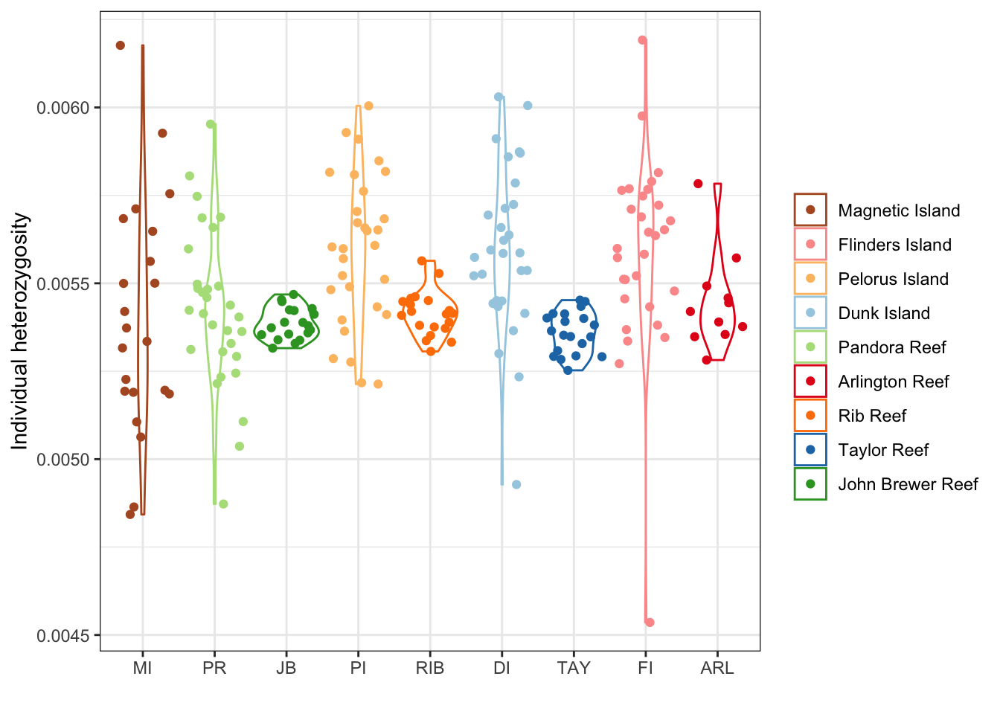
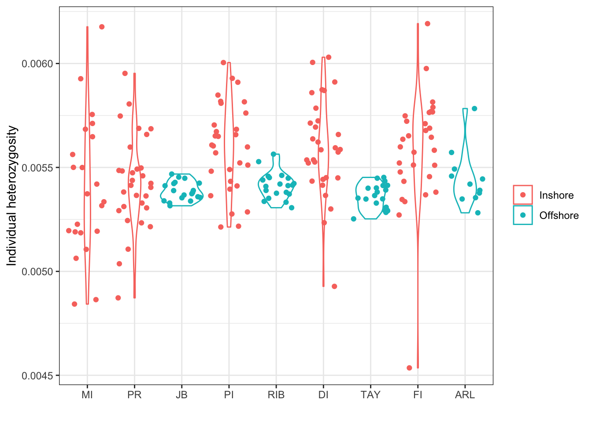
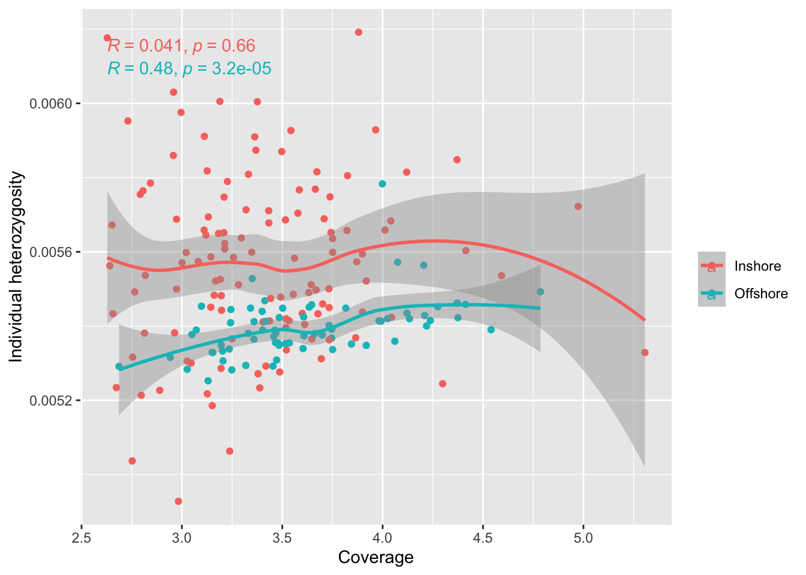
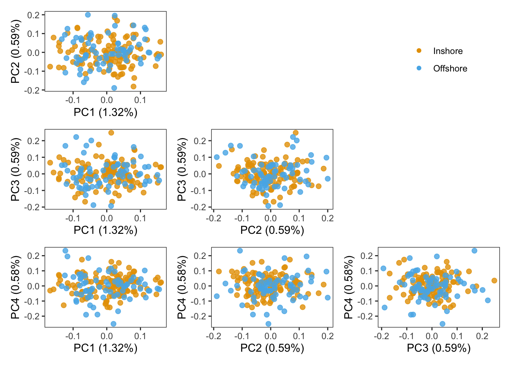

Batch Effect: what is going on here
================

Although the all samples were sequenced at about the same time, with the
same sequencing technology, same read length, we still obeserved some
suspecious batch effects from individual heterozygosity estimates. The
source could be actual biology? or the read sequencing coverage
difference as we observed in [sequencing
info](00.sample_sequencing_info). Altough, they all sequenced at
low-coverage about 3-5X, the consistent higher coverages in offshore
samples would bring some effects even the difference is minor.

A simple and quick way to check this is to plot the depth against
individual heterozygosities.

We then want to check the PCA plot again.

