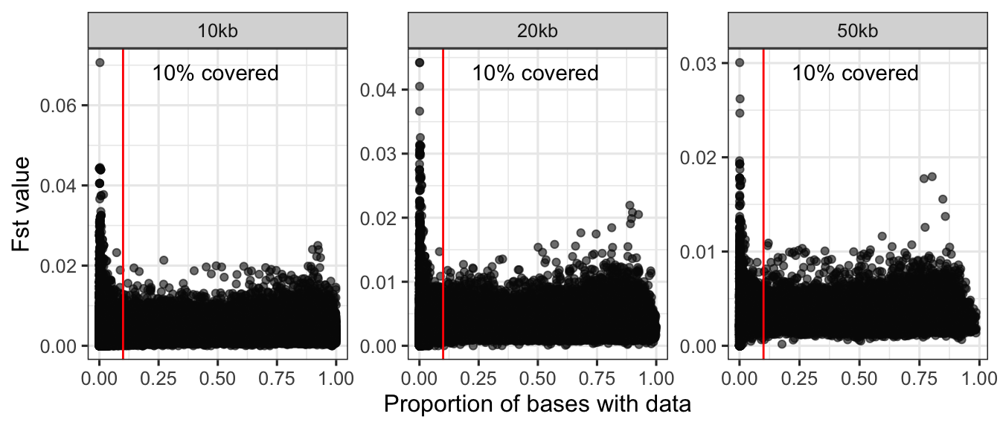
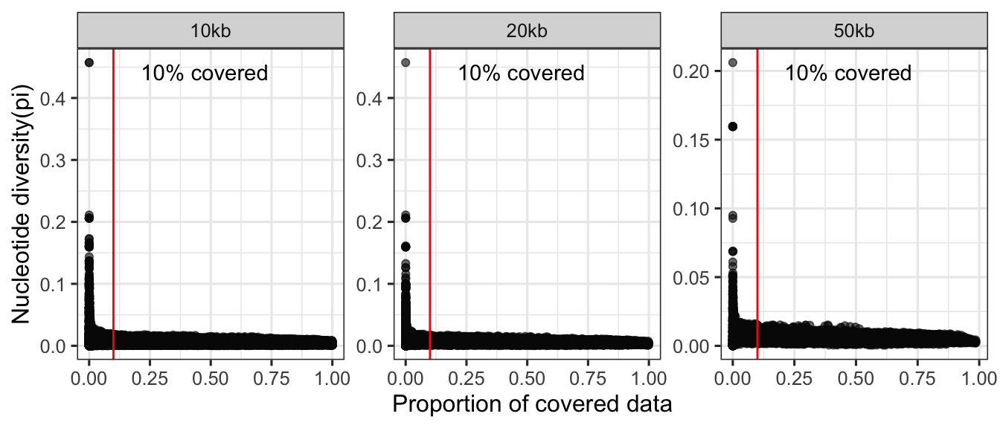

Evaluate the effect of window size and missing data in genome-wide
summary statistics
================

Genome-wide estimates of divergence/diversity usually carried out by
summarising genetic statistics in windows. These window-based statistics
not only reduce the size of data, but also provide a grouped value of a
region reflecting the biological meaning of linked selection. However,
the size of window used in studies are different, usually range from
10kb to 200kb. A big factor is the contiguity of the genome assembly,
since you can’t extract many windows in fragmented scaffolds. Also,
known recombination rate could be a good guide for choosing window
sizes. Since it isn’t always available for non-model organisms, we try
evaluate the effect of using different window size in genome-wide
scanning.

Here, we used three sizes of windows 50kb, 20kb,and 10kb with a jump
size of 10kb, 4kb,and 2kb. Using sliding windows can better capture
those signals extended out from windows.

``` bash
realSFS fst stats2 inshore_offshore.fst.idx -win 50000 -step 10000 -type 1 > inshore_offshore.w50s10.fst
realSFS fst stats2 inshore_offshore.fst.idx -win 20000 -step 4000 -type 1 > inshore_offshore.w20s4.fst
realSFS fst stats2 inshore_offshore.fst.idx -win 10000 -step 2000 -type 1 > inshore_offshore.w10s2.fst
```

### Fst


    ## # A tibble: 3 × 2
    ##   size  `Average Fst`
    ##   <chr>         <dbl>
    ## 1 10kb        0.00319
    ## 2 20kb        0.00318
    ## 3 50kb        0.00316

**Figure 1.** The density distribution of window-based Fst estimates

It seems they have quite similar estimates of average Fst across the
genome, but we saw longer tails for data from smaller window sizes.

Since some of those extreme Fst values are from windows with a lot of
missing data, we plotted the window-based Fst values along the
chromosomes with three filtering thresholds for missing data: 10%, 50%,
80%.

- **0.No filtering**


**Figure 2** Manhattan plot of Fst across the genome with no filter on
missing data

- **1. \<90% of missing data (at least 10% of the window covered)**


**Figure 3** Manhattan plot of Fst across the genome excluding windows
with more than 90% of missing data

- **2. \<50% of missing data**


**Figure 4** Manhattan plot of Fst across the genome excluding windows
with more than 50% of missing data

Results from 50kb window size seems able to capture strong signals and
differentiate them from the background. For missing data filtering,
apparently, with more stringent thresholds, our plots got sparse because
lots of windows were excluded. The point it to keep it not crazily
stringent so we can have more data while preventing false signals. Here,
we plotted the proportion of data in a window covered verses the Fst
values. It shows that a threshold of 5% (allow 95% missing data in a
window) are able to exclude most false high Fst statistics.
Interestingly, it also reflects that using 50kb window size better
capture the outliers which are potential regions under selection.



**Figure 5** The Fst estimates from windows with different proportion of
covered data.

### For genetic diversity



**Figure 6** The Nucleotide diversity estimates from windows with
different proportion of covered data.

Similarly, those extreme values are all from windows with a lot of
missing data and they affect the average values of pi. However, the rest
of the genome seems to have a very even distribution of nucleotide
diversity which also reflected in manhattan plot with 0.05 filtering.
This suggests that there is unlikely any regions in the genome with
extreme high genetic diversity.


**Figure 7** Manhattan plot of nucleotide diversity(pi) across the
genome excluding windows with more than 95% of missing data
