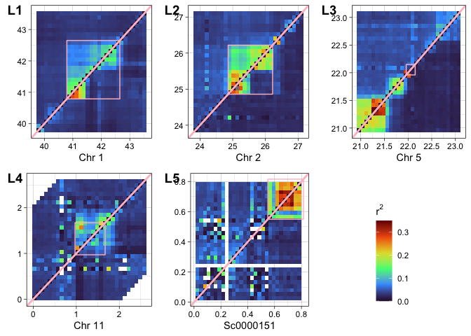

LD in and around Inversions
================

Since inversions are known to strongly suppress recombination in
heterozygotes we expect to see elevated linkage disequilibrium within
inversions compared with surrounding regions of the genome. In addition,
we expect that this pattern of LD should be most visible when analysing
data for heterozygotes and much less so for homozygotes.

To check whether this expected pattern of LD was present for inversions
identified in A. kenti we used
[ngsLD](https://github.com/fgvieira/ngsLD) to calculate linkage
disequilibrium for genomic intervals centered on each inversion and
extending up to 1Mb either side of inversion start and end points.

For each inversion we identified the majority allele and then extracted
genotype likelihood data for a 1Mb flanking interval around each
inversion separately for heterozygotes and for homozygotes of the
majority allele. For each of these datasets we then calculated LD using
ngsLD as follows (example for inversion L4 and BB genotypes)

``` bash
ngsLD --geno <L1_BB_genolikelihoods.gz> --probs --pos north_187_SNPs.ragtag_L4.sites \
            --n_ind 25 --n_sites 13677 --n_threads 10 --max_kb_dist 0 --rnd_sample 0.01 \
            --out L4_BB
```

For inversions L1-L4 we randomly subsampled SNPs to 1% in order to
reduce computational load, however since there were far fewer SNPs
available in L5 we subsampled 50% of SNPs.

We then used tidyverse functions in R to divide each interval into a
30x30 grid and calculate the mean value of the r2 statistic for all SNPs
within each gridded interval.

<!-- -->

Figure 1: Linkage disequilibrium at inversion loci calculated with
ngsLD. Values in each pixel represent the average for all SNPs within
the interval. All grid coordinates are based on pseudo-chromosome
coordinates calculated with RagTag and are in units of megabases. Black
diagonal lines divide each plot into LD for homozygotes of the most
common haplotype (bottom right) and heterozygotes (top left).
