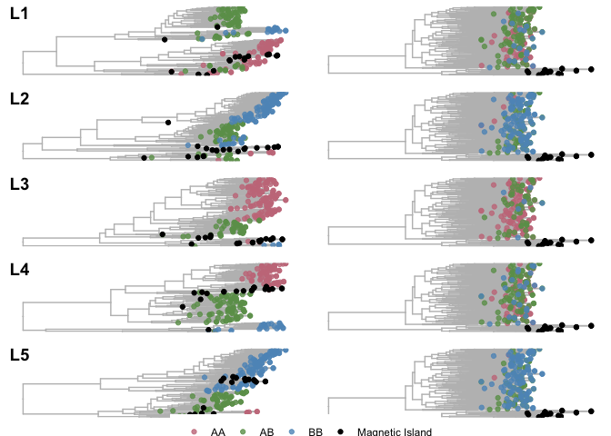

Genetic Distances between Inversion Haplotypes
================

To investigate the age of inversions relative to the split between
Magnetic Island and non-Magnetic Island populations we calculated
genetic distances between pairs of individuals at inversion loci using
[ngsDist](https://github.com/fgvieira/ngsDist).

Starting with ANGSD genotype likelihoods calculated on all 212 correctly
identified unrelated individuals we extracted data for SNPs contained
within each inversion and also for a set of 100, 50kb regions randomly
sampled from the genome. For each of these subsets we ran `ngsDist` as
shown. Here `n` refers to the inversion label.

``` bash
ngsDist --geno all_L${n}.beagle.gz --probs \
        --n_ind 212 --n_sites $(cat pos_L${n}.tsv | wc -l) \
        --labels labels.txt --pos pos_L${n}.tsv \
        --out L${n}.dist --n_threads 10 --pairwise_del
```

We then used the `hclust` package in R to generate a UPGMA tree based on
pairwise distance matrices for each of these datasets.

<!-- -->

**Figure 1:** Sample clustering based on pairwise genetic distances
within inversion regions. Each row shows sampled clustered and labelled
according to genotypes for the corresponding inversion (L1-5) (left).
Plots on the right show clustering based on pairwise distances of the
genomic background and use the same sample labelling the corresponding
plot on the left.
