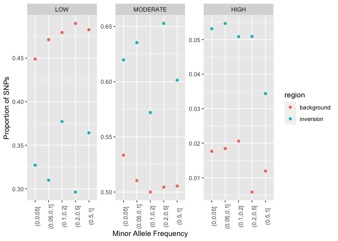
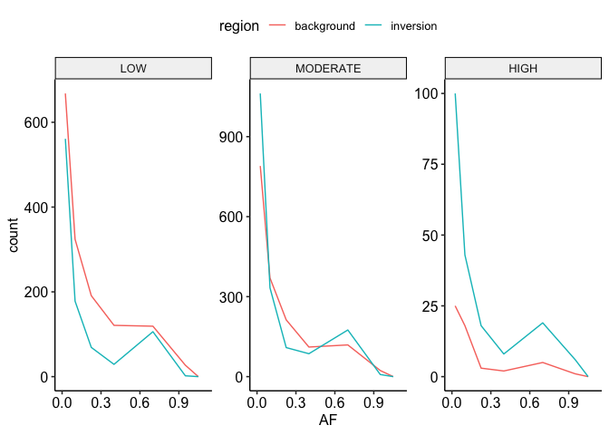

Using snpeff to examine mutational load
================

To examine mutational load in inversions compared we first used bcftools
to call variants within inversion and within a control set of loci
consisting of 100 randomly selected 50kb regions. We also performed the
same analysis using SNP calls extracted from ANGSD with qualitatively
similar results, however, since ANGSD is unable to call small indels it
is likely to miss many high impact mutations which are the main focus of
this analysis.

### Variant calling with `bcftools`

bcftools calls were made from the same bam files as used for ANGSD. Base
call and read mapping quality filters were set to remove low quality
(phred \< 20) bases and alignments. Here the `regions.bed` file includes
all inversions as well as background control regions.

``` bash
mpileup -Ou -q 20 -Q 20 \
    -R regions.bed\
    --annotate FORMAT/AD,FORMAT/ADF,FORMAT/ADR,FORMAT/DP,FORMAT/SP,INFO/AD,INFO/ADF,INFO/ADR \
    --threads 40 -f $fasta \
    -b bamlist.txt | \
    ${bcftoolsbin} call --threads 48 -mv -Oz -o north187.vcf.gz
```

Variant calls were then filtered to retain only high quality
(Phred\<30), biallelic variants and remove singletons. Variants with
biased strand balance (FS\<20) or with more than 50% missing genotypes
were also removed.

``` bash
bcftools view --min-ac 2 --max-alleles 2 -i 'QUAL>30 && INFO/FS<20 &&  F_PASS(FORMAT/GT!="mis") > 0.5' -R inversion_mappable.bed north187.vcf.gz  > north187_inv.vcf
```

### snpEff

We first built a snpEff database from the *A. kenti* reference genome
and gene models available on [reef
genomics](http://aten.reefgenomics.org/) according to the instructions
on the snpEff website.

We then ran `snpEff` to classify variants on each of our variant
datasets using the `-no-intergenic` option to focus analyses entirely
within genes. This precaution should mitigate potential biases that
might occur due to differences in gene density between inversion regions
and the genomic background

``` bash
java -jar snpEff/snpEff.jar -no-intergenic  aten north187_inv.vcf > north187_inv.snpeff.vcf
```

We then classified variants according to their variant “severity”,
paying attention to variants with low, medium and high severity.
Variants were also classified by allele frequency. Here we chose to
ignore variants with very high frequency (AF\>0.99) as these likely
correspond to rare variants or errors in the reference sequence.

<!-- -->

<!-- -->
