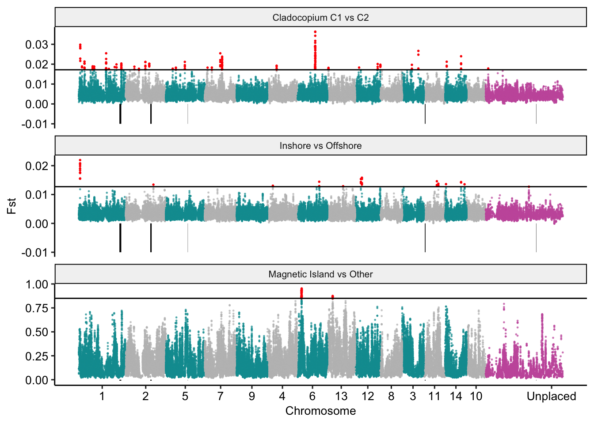

Scans for allele frequency differences (Fst) between groups
================

Since we found no evidence for divergent selection at inversions we
searched for signatures of this type of selection at all loci
genome-wide. For this analysis we defined three pairwise comparisons of
interest;

1.  Inshore vs Offshore for non-Magnetic Island individuals
2.  Cladocopium C1 vs C2 for non-Magnetic Island individuals
3.  Magnetic Island vs non-Magnetic Island.

### Fst and Theta stats in sliding windows

For each comparison we first generated an appropriate 2d folded sfs and
indexed fst file. The process is illustrated below for the C1, C2
symbiont comparison.

First find sites with SNPs that occur jointly across both groups with
our given minInd threshold.

``` bash
angsd -bam c1c2_bam.list -ref ${ref} -anc ${ref} -C 50 \
       -GL 2 -doSaf 1 -sites ${bed} -doMaf 1 -doCounts 1 -minQ 30 -minMapQ 30 \
       -nThreads 40 -uniqueOnly 1 -doMajorMinor 1 -out c1c2_minInd40 -minInd 40

zcat c1c2_minInd40.mafs.gz|sed '1d'|cut -f1,2 > c1c2_minInd40.sites
angsd sites index c1c2_minInd40.sites
```

Then generate maf files independently at these sites for each subgroup

``` bash
angsd -bam c1_bam.list -ref ${ref} -anc ${ref} -sites c1c2_minInd40.sites \
       -GL 2 -doSaf 1 -doMaf 1 -nThreads 40 -doMajorMinor 1 -out c1

angsd -bam c2_bam.list -ref ${ref} -anc ${ref} -sites c1c2_minInd40.sites \
       -GL 2 -doSaf 1 -doMaf 1 -nThreads 40 -doMajorMinor 1 -out c2
```

Then use `realSFS` to generate the folded 2dsfs and indexed fst file

``` bash
realSFS -P 24 c1.saf.idx c2.saf.idx -fold 1 > c1_c2.folded.2dsfs
realSFS fst index c1.saf.idx c2.saf.idx -sfs c1_c2.folded.2dsfs -fold 1 -fstout c1_c2
```

Finally, calculate Fst in 20kb sliding windows with a 4kb step

``` bash
realSFS fst stats2 c1_c2.fst.idx -win 20000 -step 4000 -type 1 > c1_c2.w20s4.fst
```

To complement Fst analyses we also used the `thetaStat` module in ANGSD
to calculate a range of genetic diversity indicators on each population
individually. This is illustrated for the C1 population below

First calculate the 1d folded sfs

``` bash
realSFS c1.saf.idx -P 24 -fold 1 > c1.folded.1dsfs
```

Then use `saf2theta` to create an indexed file suitable for processing
with thetaStat

``` bash
realSFS saf2theta c1.saf.idx -sfs c1.folded.1dsfs -outname c1 -fold 1
```

Finally we calculate thetas in 20kb sliding windows with a 4kb step

``` bash
../../angsd/misc/thetaStat do_stat c1.thetas.idx -win 20000 -step 4000 -outnames c1.w20s4.theta -type 1
```

We also calculated `dxy` for population pairs. In this case we used this
[getDxy.pl](https://github.com/mfumagalli/ngsPopGen/blob/master/scripts/getDxy.pl)
perl script. The process for C1 and C2 is illustrated below.

``` bash
# Calculates raw values
perl scripts/getDxy.pl --pop1maf <(zcat c1.mafs.gz) --pop2maf <(zcat c2.mafs.gz) --minInd 1 > c1_c2.getDxy.txt

cut -f1,2,3 c1_c2.w20s4.fst |sed '1d'|\
perl -F"\t" -nle '@F[0]=~m/(\(\d+,\d+\))(\(\d+,\d+\))\((\d+),(\d+)\).*/g; print join "\t",@F[1],$3,$4, @F[2];' >angsd_fst_window_w20s4.bed

# Calculates average values in the same sliding windows as used for Fst
bedtools intersect -a angsd_fst_window_w20s4.bed -b <(awk '{print $1"\t"$2"\t"$2"\t"$3}' c1_c2.getDxy.txt | grep -v 'chromo') -loj |\
bedtools groupby -g 1,2,3 -c 8 -o mean| awk '{print $1"\t"($2+$3)/2"\t"$4}' > c1_c2.w20s4.getDxy.txt
```

### Conversion to pseudo-chromosome coordinates

All outputs were converted to RagTag pseudo-chromosome coordinates. The
process for C1 C2 is illustrated below

``` bash
cd data/c1_vs_c2
cat c1_c2.w20s4.fst | grep -v 'chr'  | awk '{OFS="\t";print $2,$3,$4,$5}' > c1_c2.w20s4_4column.fst
python ../../scripts/translate_coords.py --keep c1_c2.w20s4_4column.fst ../ragtag/ragtag.scaffold.agp > c1_c2.w20s4.ragtag.txt

python ../../scripts/translate_coords.py --keep c1_c2.w20s4.getDxy.txt ../ragtag/ragtag.scaffold.agp  > c1_c2.w20s4.getDxy.ragtag.txt

python ../../scripts/translate_coords.py --keep <(grep -v 'Chr' c1.w20s4.theta.pestPG | cut -f 2-) ../ragtag/ragtag.scaffold.agp > c1.w20s4.theta.ragtag.pestPG
python ../../scripts/translate_coords.py --keep <(grep -v 'Chr' c2.w20s4.theta.pestPG | cut -f 2-) ../ragtag/ragtag.scaffold.agp > c2.w20s4.theta.ragtag.pestPG
```

Overlay inversion positions


