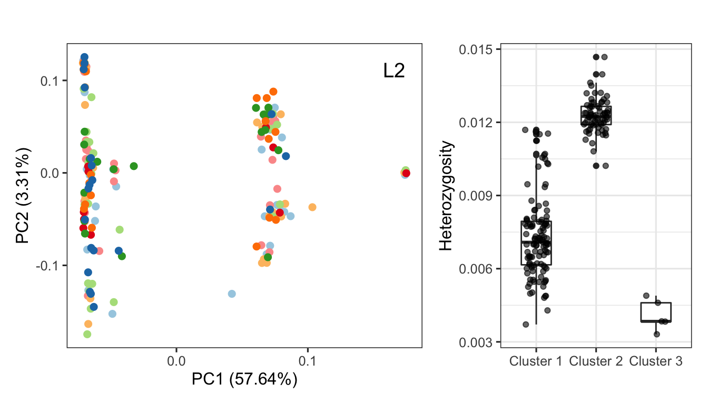
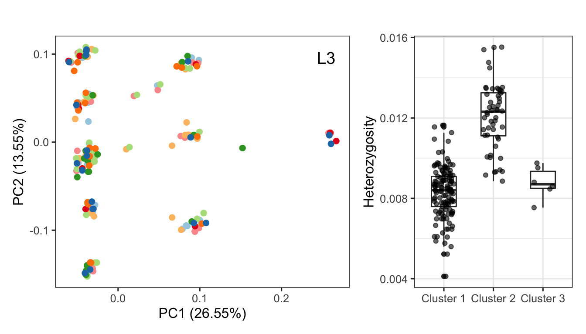
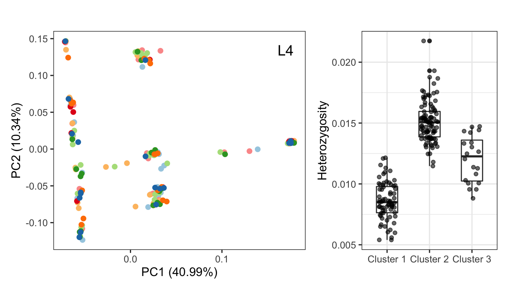

The heterozygosity within islands of differentiation
================

Our genome-wide scan based on PCA revealed local regions significantly
structuring the populations within samples from the north reefs (except
Magnetic Island). [here](09.pcangsd_selection.md). The PCA plots of
these regions quantatively display three clusters. Here, we examined the
individual heterozygosity of samples in each cluster.

Locus used in analysis:

- Sc0000185:41650-310310 (L2)
- Sc0000135:526260-880608 (L3)
- Sc0000214:345-241,228 (L4)

Angsd was used again to estimate saf and calculate the number of
heterozygosity sites within regions.

**L2:Sc0000185:41,650-310,310**

**L3:Sc0000135:526,260-880,608**

**L4:Sc0000214:345-241,228**

