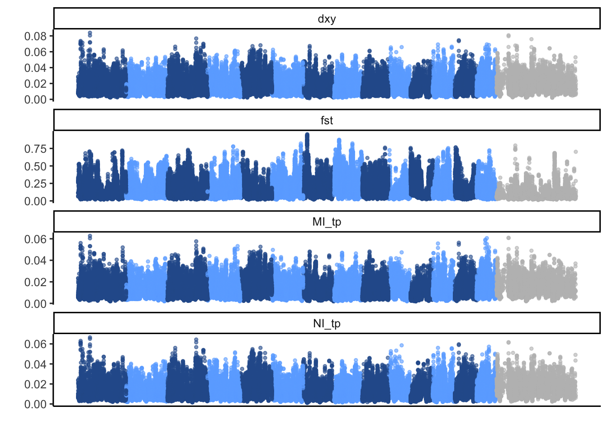
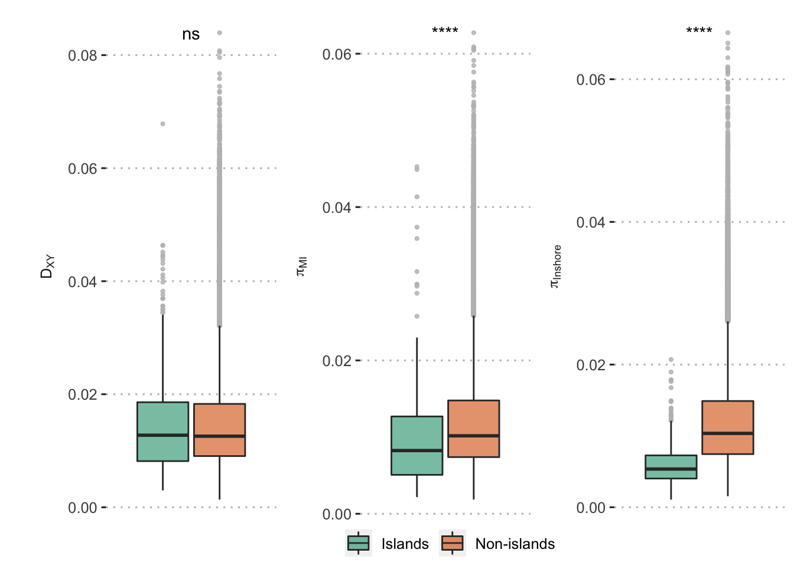
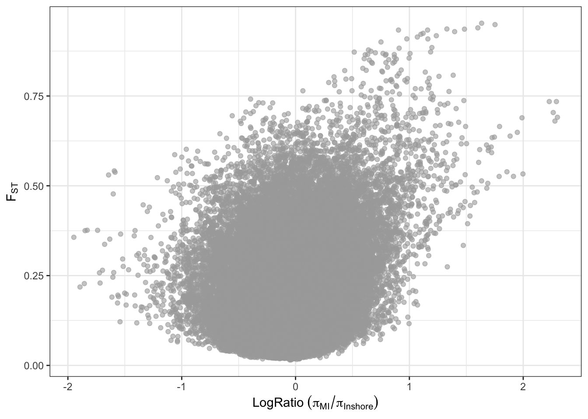
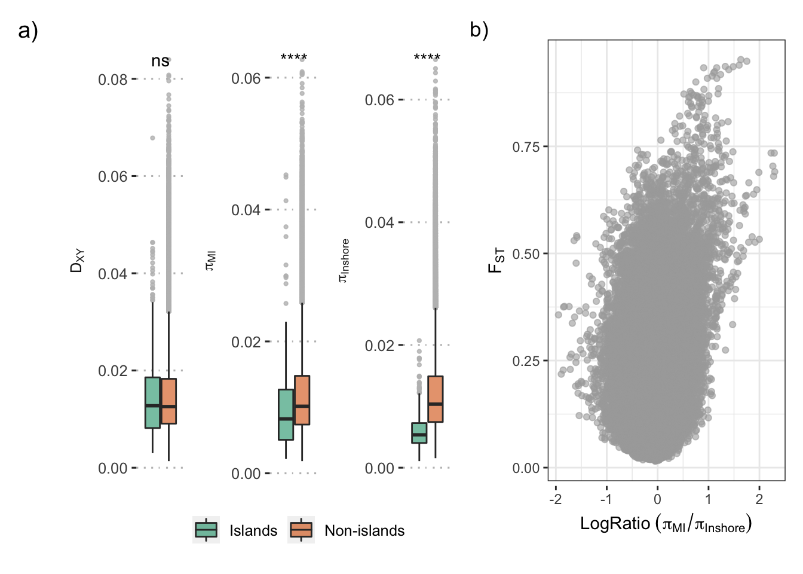

Genomic Island between North Inshore reefs and reefs of Magnetic Island
================

We didn’t observe agreements between relative divergence (fst) and
absolute diversity(dxy). As a matter of fact, the dxy values are lower
in those high Fst regions, suggests they result from recurrent
selections before and after speciation which means they have low
nucleotide diversity in the ancestor population.

We didn’t oberve elevated absolute divergence (dxy) in highly diverged
regions (high fst), which suggests there is no strong evidence for gene
flow barrier in those regions. Meanwhile, low levels of nucleotide
diversity were observed in both north inshore group and corals from
magnetic island suggest selection reduced the genetic diversity in those
highly diverged regions result in high relative divergence.
