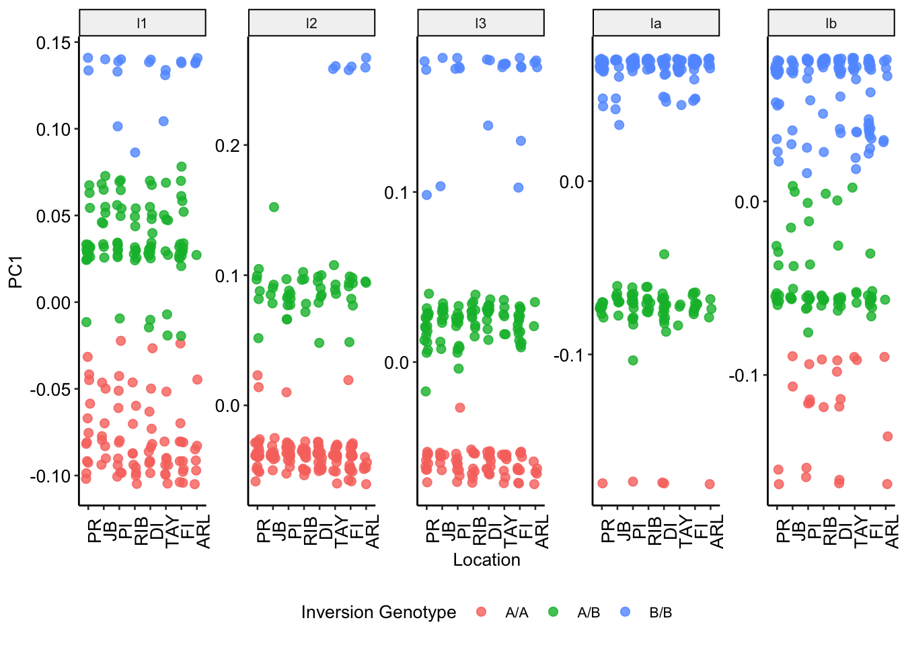

Analysis of Inversion Genotypes
================

Inversions give rise to a characteristic pattern of genetic structure
when PCA is applied to SNPs within the inversion region. This structure
groups samples into three clusters corresponding to three potential
genotypes of the inversion itself, ie A/A, A/B, B/A where A and B
represent the two orientations of the inversion. In cases where the
clusters are clear it is possible to infer the genotypes of samples
according to their cluster membership and thereby investigate basic
genetic properties of the inversion alleles.

To assign samples to clusters we use kmeans clustering (with k=3) based
on position along PC1 and with the initial centers of clusters at
min(PC1), (min(PC1)+max(PC1))/2, max(PC1) for genotypes A/A, A/B and B/B
respectively.

To check that this automatic clustering method produces sensible cluster
assignments we visualise asignments along with the original PC1 data for
all inversion loci as in the plot below.

Having assigned genotypes we then performed two tests. First we tested
to see if overall distribution of genotypes at each locus is in Hardy
Weinberg Equilibrium (HWE). We found no significant deviations from HWE
except for locus lb which had a p-value of 0.01. In this case the
distinction between clusters is not particularly clear so the result
might simply reflect bias in our cluster assignment.

    ##         l1         l2         l3         la         lb 
    ## 0.32717668 0.58400345 0.75688184 0.18902234 0.01187087

Next we calculated Fst per-locus between inshore and offshore. There is
no p-value calculation here, however, we can see that all values are low
“\<0.007” indicating no clear evidence for strong differential selection
at these inversions.

    ##           l1           l2           l3           la           lb 
    ## -0.002888588 -0.004370778 -0.003642590  0.002891362 -0.006692144
